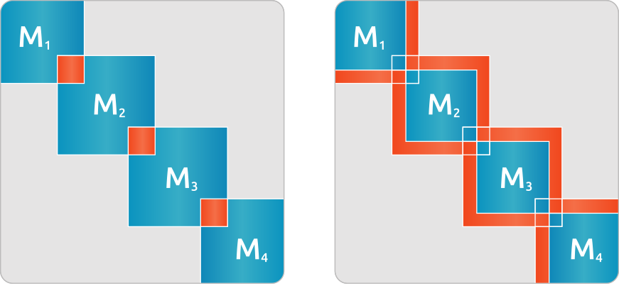

.. meta::
   :description: A sparse linear algebra library with focus on exploring fine-grained parallelism on top of the AMD ROCm runtime and toolchains
   :keywords: rocALUTION, ROCm, library, API, tool

.. _preconditioners:

###############
Preconditioners
###############

This document provides a category-wise listing of the preconditioners. All preconditioners support local operators. They can be used as a global preconditioner via block-jacobi scheme, which works locally on each interior matrix. To provide fast application, all preconditioners require extra memory to keep the approximated operator.

.. doxygenclass:: rocalution::Preconditioner

Code structure
==============

The preconditioners provide a solution to the system :math:`Mz = r`, where the solution :math:`z` is either directly computed by the approximation scheme or iteratively obtained with :math:`z = 0` initial guess.

Jacobi method
=============

.. doxygenclass:: rocalution::Jacobi
.. note:: To adjust the damping parameter :math:`\omega`, use :cpp:func:`rocalution::FixedPoint::SetRelaxation`.

(Symmetric) Gauss-Seidel or (S)SOR method
==========================================

.. doxygenclass:: rocalution::GS
.. doxygenclass:: rocalution::SGS
.. note:: To adjust the relaxation parameter :math:`\omega`, use :cpp:func:`rocalution::FixedPoint::SetRelaxation`.

Incomplete factorizations
=========================

ILU
---

.. doxygenclass:: rocalution::ILU
.. doxygenfunction:: rocalution::ILU::Set

ILUT
----

.. doxygenclass:: rocalution::ILUT
.. doxygenfunction:: rocalution::ILUT::Set(double)
.. doxygenfunction:: rocalution::ILUT::Set(double, int)

IC
---

.. doxygenclass:: rocalution::IC

AI Chebyshev
============

.. doxygenclass:: rocalution::AIChebyshev
.. doxygenfunction:: rocalution::AIChebyshev::Set

FSAI
====

.. doxygenclass:: rocalution::FSAI
.. doxygenfunction:: rocalution::FSAI::Set(int)
.. doxygenfunction:: rocalution::FSAI::Set(const OperatorType&)
.. doxygenfunction:: rocalution::FSAI::SetPrecondMatrixFormat

SPAI
====

.. doxygenclass:: rocalution::SPAI
.. doxygenfunction:: rocalution::SPAI::SetPrecondMatrixFormat

TNS
===

.. doxygenclass:: rocalution::TNS
.. doxygenfunction:: rocalution::TNS::Set
.. doxygenfunction:: rocalution::TNS::SetPrecondMatrixFormat

MultiColored preconditioners
============================

.. doxygenclass:: rocalution::MultiColored
.. doxygenfunction:: rocalution::MultiColored::SetPrecondMatrixFormat
.. doxygenfunction:: rocalution::MultiColored::SetDecomposition

MultiColored (symmetric) Gauss-Seidel / (S)SOR
----------------------------------------------

.. doxygenclass:: rocalution::MultiColoredGS
.. doxygenclass:: rocalution::MultiColoredSGS
.. doxygenfunction:: rocalution::MultiColoredSGS::SetRelaxation
.. note:: To change the preconditioner matrix format, use :cpp:func:`rocalution::MultiColored::SetPrecondMatrixFormat`.

MultiColored power(q)-pattern method ILU(p,q)
---------------------------------------------

.. doxygenclass:: rocalution::MultiColoredILU
.. doxygenfunction:: rocalution::MultiColoredILU::Set(int)
.. doxygenfunction:: rocalution::MultiColoredILU::Set(int, int, bool)
.. note:: To change the preconditioner matrix format, use :cpp:func:`rocalution::MultiColored::SetPrecondMatrixFormat`.

Multi-elimination incomplete LU
===============================

.. doxygenclass:: rocalution::MultiElimination
.. doxygenfunction:: rocalution::MultiElimination::GetSizeDiagBlock
.. doxygenfunction:: rocalution::MultiElimination::GetLevel
.. doxygenfunction:: rocalution::MultiElimination::Set
.. doxygenfunction:: rocalution::MultiElimination::SetPrecondMatrixFormat

Diagonal preconditioner for saddle-point problems
=================================================

.. doxygenclass:: rocalution::DiagJacobiSaddlePointPrecond
.. doxygenfunction:: rocalution::DiagJacobiSaddlePointPrecond::Set

(Restricted) Additive Schwarz preconditioner
============================================

.. doxygenclass:: rocalution::AS
.. doxygenfunction:: rocalution::AS::Set
.. doxygenclass:: rocalution::RAS

See the overlapped area in the figure below:

.. _AS:

  Example of a 4 block-decomposed matrix - Additive Schwarz with overlapping preconditioner (left) and Restricted Additive Schwarz preconditioner (right).

Block-Jacobi (MPI) preconditioner
=================================

.. doxygenclass:: rocalution::BlockJacobi
.. doxygenfunction:: rocalution::BlockJacobi::Set

See the Block-Jacobi (MPI) preconditioner in the figure below:

.. _BJ:
.. figure:: ../data/BJ.png
  :alt: 4 block jacobi
  :align: center

  Example of a 4 block-decomposed matrix - Block-Jacobi preconditioner.

Block preconditioner
====================

.. doxygenclass:: rocalution::BlockPreconditioner
.. doxygenfunction:: rocalution::BlockPreconditioner::Set
.. doxygenfunction:: rocalution::BlockPreconditioner::SetDiagonalSolver
.. doxygenfunction:: rocalution::BlockPreconditioner::SetLSolver
.. doxygenfunction:: rocalution::BlockPreconditioner::SetExternalLastMatrix
.. doxygenfunction:: rocalution::BlockPreconditioner::SetPermutation

Variable preconditioner
=======================

.. doxygenclass:: rocalution::VariablePreconditioner
.. doxygenfunction:: rocalution::VariablePreconditioner::SetPreconditioner
