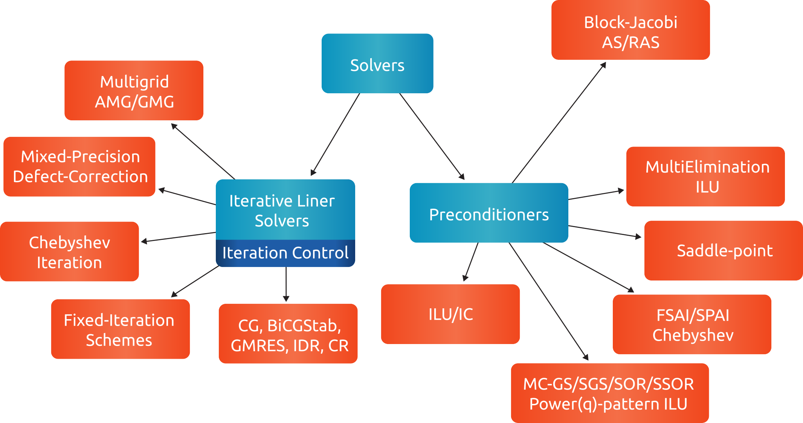

.. meta::
   :description: A sparse linear algebra library with focus on exploring fine-grained parallelism on top of the AMD ROCm runtime and toolchains
   :keywords: rocALUTION, ROCm, library, API, tool

.. _source-code-organization:

********************************
Library source code organization
********************************

The rocALUTION library is split into three major directories:

- ``src/base/``: Contains all source code that is built on top of the :cpp:class:`BaseRocalution <rocalution::BaseRocalution>` object as well as the backend structure.
- ``src/solvers/``: Contains all solvers, preconditioners, and its control classes.
- ``src/utils/``: Contains memory (de)allocation, logging, communication, timing, and math helper functions.

``src/base/`` directory
----------------------------

The source files in the ``src/base/`` directory are listed below.

Backend Manager
```````````````
The support of accelerator devices is embedded in the structure of rocALUTION.
The primary goal is to use this technology whenever possible to decrease the computational time.

Each technology has its own backend implementation, dealing with platform-specific functionalities such as initialization, synchronization, reservation, etc.
The backends are currently available for CPU (naive, OpenMP, MPI) and GPU (HIP).

.. note:: Not all functions are ported and present on the accelerator backend.
          This limited functionality is natural, since all operations can't be performed efficiently on the accelerators (e.g. sequential algorithms, I/O from the file system, etc.).

The Operator and Vector classes
```````````````````````````````
The :cpp:class:`Operator <rocalution::Operator>` and :cpp:class:`Vector <rocalution::Vector>` classes and their derived local and global classes are the classes available through the rocALUTION API.
While granting access to all relevant functionalities, all hardware-relevant implementation details are hidden.
Those linear operators and vectors are the main objects in rocALUTION.
They can be moved to an accelerator at run-time.

The linear operators are defined as local or global metrices (i.e. on a single node or distributed/multi-node) and local stencils (i.e. matrix-free linear operations).
The only template parameter of the operators and vectors is the data type (ValueType). The figure below provides an overview of supported operators and vectors.

.. _operatorsd:
.. figure:: ../data/operators.png
  :alt: operator and vector classes
  :align: center

  Operator and vector classes.

Each object contains a local copy of the hardware descriptor created by the :cpp:func:`init_rocalution <rocalution::init_rocalution>` function.
Additionally, each local object that is derived from an operator or vector, contains a pointer to a `Base`-class, a `Host`-class and an `Accelerator`-class of same type (e.g. a :cpp:class:`LocalMatrix <rocalution::LocalMatrix>` contains pointers to :cpp:class:`BaseMatrix <rocalution::BaseMatrix>`, :cpp:class:`HostMatrix <rocalution::HostMatrix>` and :cpp:class:`AcceleratorMatrix <rocalution::AcceleratorMatrix>`).
The ``Base`` class pointer always points either towards the ``Host`` class or the ``Accelerator`` class pointer depending on the runtime decision of the local object.
``Base`` classes and their derivatives are further explained in :ref:`rocalution_base_classes`.

Furthermore, each global object derived from an operator or vector embeds two ``Local`` classes of the same type to store the interior and ghost part of the global object (e.g. a :cpp:class:`GlobalVector <rocalution::GlobalVector>` contains two :cpp:class:`LocalVector <rocalution::LocalVector>`).
For more details on distributed data structures, see the API reference section.

.. _rocalution_base_classes:

The BaseMatrix and BaseVector classes
`````````````````````````````````````
The ``data`` is an object pointing to the ``BaseMatrix`` class from either a ``HostMatrix`` or an ``AcceleratorMatrix``.
The ``AcceleratorMatrix`` is created by an object with an implementation in the backend and a matrix format.
Switching between host and accelerator metrices is performed in the ``LocalMatrix`` class.
The ``LocalVector`` is organized in the same way.

Each matrix format has its own class for the host and the accelerator backend.
All matrix classes are derived from the ``BaseMatrix``, which provides the base interface for computation as well as for accessing the data.

Each local object contains a pointer to a ``Base`` class object.
While the ``Base`` classes are purely virtual, their derivatives implement all platform-specific functionalities.
Each of them is coupled to a rocALUTION backend descriptor.
While the :cpp:class:`HostMatrix <rocalution::HostMatrix>`, :cpp:class:`HostStencil <rocalution::HostStencil>` and :cpp:class:`HostVector <rocalution::HostVector>` classes implement all host functionalities, :cpp:class:`AcceleratorMatrix <rocalution::AcceleratorMatrix>`, :cpp:class:`AcceleratorStencil <rocalution::AcceleratorStencil>` and :cpp:class:`AcceleratorVector <rocalution::AcceleratorVector>` contain accelerator-related device code.
Each backend specialization is located in a different directory, e.g. ``src/base/host`` for host-related classes and ``src/base/hip`` for accelerator/HIP-related classes.

ParallelManager
```````````````
The parallel manager class handles the communication and the mapping of the global operators.
Each global operator and vector needs to be initialized with a valid parallel manager to perform any operation.
For many distributed simulations, the underlying operator is already distributed.
This information must be passed to the parallel manager.
All communication-related functionalities for the implementation of global algorithms is available in the rocALUTION communicator in ``src/utils/communicator.hpp``.
For more details on distributed data structures, see the API Reference section.

``src/solvers/`` directory
----------------------------

The :cpp:class:`Solver <rocalution::Solver>` and its derived classes can be found in ``src/solvers``.
The directory structure is further split into the sub-classes :cpp:class:`DirectLinearSolver <rocalution::DirectLinearSolver>` in ``src/solvers/direct``, :cpp:class:`IterativeLinearSolver <rocalution::IterativeLinearSolver>` in ``src/solvers/krylov``, :cpp:class:`BaseMultiGrid <rocalution::BaseMultiGrid>` in ``src/solvers/multigrid`` and :cpp:class:`Preconditioner <rocalution::Preconditioner>` in ``src/solvers/preconditioners``.
Each solver uses an :cpp:class:`Operator <rocalution::Operator>`, :cpp:class:`Vector <rocalution::Vector>` and data type as template parameters to solve a linear system of equations.
The actual solver algorithm is implemented by the :cpp:class:`Operator <rocalution::Operator>` and :cpp:class:`Vector <rocalution::Vector>` functionality.

Most of the solvers can be performed on linear operators, e.g. :cpp:class:`LocalMatrix <rocalution::LocalMatrix>`, :cpp:class:`LocalStencil <rocalution::LocalStencil>` and :cpp:class:`GlobalMatrix <rocalution::GlobalMatrix>` - i.e. the solvers can be performed locally (on a shared memory system) or in a distributed manner (on a cluster) via MPI.
All solvers and preconditioners need three template parameters - Operators, Vectors and Scalar type.
The Solver class is purely virtual and provides an interface for:

- :cpp:func:`SetOperator <rocalution::Solver::SetOperator>` to set the operator, which allows you to pass the matrix here.
- :cpp:func:`Build <rocalution::Solver::Build>` to build the solver (including preconditioners, sub-solvers, etc.).
  You must specify the operator before building the solver.
- :cpp:func:`Solve <rocalution::Solver::Solve>` to solve the sparse linear system.
  You need to pass a right-hand side and a solution / initial guess vector.
- :cpp:func:`Print <rocalution::Solver::Print>` to show solver information.
- :cpp:func:`ReBuildNumeric <rocalution::Solver::ReBuildNumeric>` to only rebuild the solver numerically (if possible).
- :cpp:func:`MoveToHost <rocalution::Solver::MoveToHost>` and :cpp:func:`MoveToAccelerator <rocalution::Solver::MoveToAccelerator>` to offload the solver (including preconditioners and sub-solvers) to the host / accelerator.

.. _solvers:


   Solver and preconditioner classes.

``src/utils/`` directory
--------------------------
In the ``src/utils`` directory, all commonly used host (de)allocation, timing, math, communication, and logging functionalities are gathered.

Furthermore, the rocALUTION ``GlobalType``, which is the indexing type for global and distributed structures, can be adjusted in ``src/utils/types.hpp``.
By default, rocALUTION uses 64-bit wide global indexing.

.. note:: It is not recommended to switch to 32-bit global indexing.

In ``src/utils/def.hpp``:

- Verbosity level ``VERBOSE_LEVEL`` can be adjusted, see :ref:`rocalution_verbose`,
- Debug mode ``DEBUG_MODE`` can be enabled, see :ref:`rocalution_debug`,
- MPI logging ``LOG_MPI_RANK`` can be modified, see :ref:`rocalution_logging`,
- Object tracking ``OBJ_TRACKING_OFF`` can be enabled, see :ref:`rocalution_obj_tracking`.
