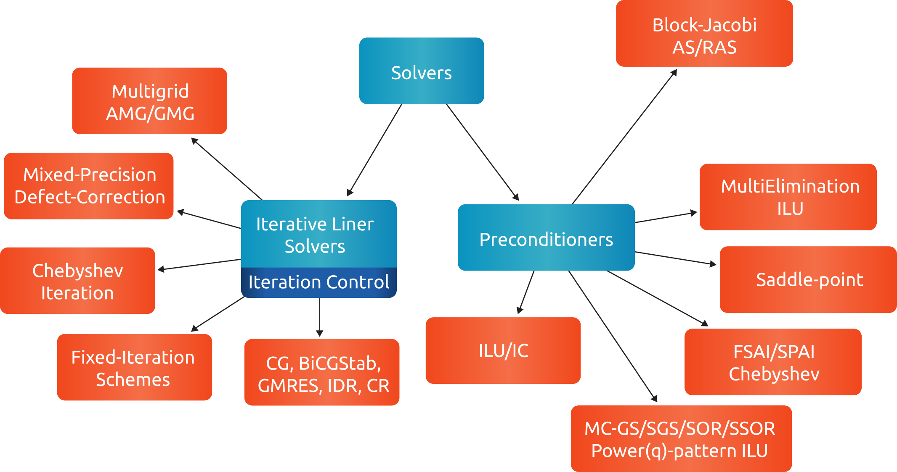

*********************
Design and Philosophy
*********************
rocALUTION is written in C++ and HIP.

The main idea of the rocALUTION objects is that they are separated from the actual hardware specification.
Once you declare a matrix, a vector or a solver they are initially allocated on the host (CPU).
Then, every object can be moved to a selected accelerator by a simple function call.
The whole execution mechanism is based on run-time type information (RTTI), which allows you to select where and how you want to perform the operations at run time.
This is in contrast to the template-based libraries, which need this information at compile time.

The philosophy of the library is to abstract the hardware-specific functions and routines from the actual program, that describes the algorithm.
It is hard and almost impossible for most of the large simulation software based on sparse computation, to adapt and port their implementation in order to use every new technology.
On the other hand, the new high performance accelerators and devices have the capability to decrease the computational time significantly in many critical parts.

This abstraction layer of the hardware specific routines is the core of the rocALUTION design.
It is built to explore fine-grained level of parallelism suited for multi/many-core devices.
This is in contrast to most of the parallel sparse libraries available which are mainly based on domain decomposition techniques.
Thus, the design of the iterative solvers the preconditioners is very different.
Another cornerstone of rocALUTION is the native support of accelerators - the memory allocation, transfers and specific hardware functions are handled internally in the library.

rocALUTION helps you to use accelerator technologies but does not force you to use them.
Even if you offload your algorithms and solvers to the accelerator device, the same source code can be compiled and executed in a system without any accelerator.

Naturally, not all routines and algorithms can be performed efficiently on many-core systems (i.e. on accelerators).
To provide full functionality, the library has internal mechanisms to check if a particular routine is implemented on the accelerator.
If not, the object is moved to the host and the routine is computed there.
This guarantees that your code will run with any accelerator, regardless of the available functionality for it.

Library Source Code Organization
================================
The rocALUTION library is split into three major parts:

- The `src/base/` directory contains all source code that is built on top of the :cpp:class:`BaseRocalution <rocalution::BaseRocalution>` object as well as the backend structure.
- `src/solvers/` contains all solvers, preconditioners and its control classes.
- In `src/utils/` memory (de)allocation, logging, communication, timing and math helper functions are placed.

The `src/base/` directory
-------------------------

Backend Manager
```````````````
The support of accelerator devices is embedded in the structure of rocALUTION.
The primary goal is to use this technology whenever possible to decrease the computational time.

Each technology has its own backend implementation, dealing with platform specific initialization, synchronization, reservation, etc. functionality.
Currently available backends are for CPU (naive, OpenMP, MPI) and GPU (HIP).

.. note:: Not all functions are ported and present on the accelerator backend.
          This limited functionality is natural, since not all operations can be performed efficiently on the accelerators (e.g. sequential algorithms, I/O from the file system, etc.).

The Operator and Vector classes
```````````````````````````````
The :cpp:class:`Operator <rocalution::Operator>` and :cpp:class:`Vector <rocalution::Vector>` classes and its derived local and global classes, are the classes available by the rocALUTION API.
While granting the user access to all relevant functionality, all hardware relevant implementation details are hidden.
Those linear operators and vectors are the main objects in rocALUTION.
They can be moved to an accelerator at run time.

The linear operators are defined as local or global matrices (i.e. on a single node or distributed/multi-node) and local stencils (i.e. matrix-free linear operations).
The only template parameter of the operators and vectors is the data type (ValueType).
:numref:`operators` gives an overview of supported operators and vectors.

.. _operators:
.. figure:: ../fig/operators.png
  :alt: operator and vector classes
  :align: center

  Operator and vector classes.

Each of the objects contain a local copy of the hardware descriptor created by the :cpp:func:`init_rocalution <rocalution::init_rocalution>` function.
Additionally, each local object that is derived from an operator or vector, contains a pointer to a `Base`-class, a `Host`-class and an `Accelerator`-class of same type (e.g. a :cpp:class:`LocalMatrix <rocalution::LocalMatrix>` contains pointers to a :cpp:class:`BaseMatrix <rocalution::BaseMatrix>`, :cpp:class:`HostMatrix <rocalution::HostMatrix>` and :cpp:class:`AcceleratorMatrix <rocalution::AcceleratorMatrix>`).
The `Base`-class pointer will always point towards either the `Host`-class or the `Accelerator`-class pointer, dependend on the runtime decision of the local object.
`Base`-classes and their derivatives are further explained in :ref:`rocalution_base_classes`.

Furthermore, each global object, derived from an operator or vector, embeds two `Local`-classes of same type to store the interior and ghost part of the global object (e.g. a :cpp:class:`GlobalVector <rocalution::GlobalVector>` contains two :cpp:class:`LocalVector <rocalution::LocalVector>`).
For more details on distributed data structures, see the user manual.

.. _rocalution_base_classes:

The BaseMatrix and BaseVector classes
`````````````````````````````````````
Each local object contains a pointer to a `Base`-class object.
While the `Base`-class is mainly pure virtual, their derivatives implement all platform specific functionality.
Each of them is coupled to a rocALUTION backend descriptor.
While the :cpp:class:`HostMatrix <rocalution::HostMatrix>`, :cpp:class:`HostStencil <rocalution::HostStencil>` and :cpp:class:`HostVector <rocalution::HostVector>` classes implements all host functionality, :cpp:class:`AcceleratorMatrix <rocalution::AcceleratorMatrix>`, :cpp:class:`AcceleratorStencil <rocalution::AcceleratorStencil>` and :cpp:class:`AcceleratorVector <rocalution::AcceleratorVector>` contain accelerator related device code.
Each of the backend specializations are located in a different directory, e.g. `src/base/host` for host related classes and `src/base/hip` for accelerator / HIP related classes.

ParallelManager
```````````````
The parallel manager class handles the communication and the mapping of the global operators.
Each global operator and vector need to be initialized with a valid parallel manager in order to perform any operation.
For many distributed simulations, the underlying operator is already distributed.
This information need to be passed to the parallel manager.
All communication functionality for the implementation of global algorithms is available in the rocALUTION communicator in `src/utils/communicator.hpp`.
For more details on distributed data structures, see the user manual.

The `src/solvers/` directory
----------------------------
The :cpp:class:`Solver <rocalution::Solver>` and its derived classes can be found in `src/solvers`.
The directory structure is further split into the sub-classes :cpp:class:`DirectLinearSolver <rocalution::DirectLinearSolver>` in `src/solvers/direct`, :cpp:class:`IterativeLinearSolver <rocalution::IterativeLinearSolver>` in `src/solvers/krylov`, :cpp:class:`BaseMultiGrid <rocalution::BaseMultiGrid>` in `src/solvers/multigrid` and :cpp:class:`Preconditioner <rocalution::Preconditioner>` in `src/solvers/preconditioners`.
Each of the solver is using an :cpp:class:`Operator <rocalution::Operator>`, :cpp:class:`Vector <rocalution::Vector>` and data type as template parameters to solve a linear system of equations.
The actual solver algorithm is implemented by the :cpp:class:`Operator <rocalution::Operator>` and :cpp:class:`Vector <rocalution::Vector>` functionality.

Most of the solvers can be performed on linear operators, e.g. :cpp:class:`LocalMatrix <rocalution::LocalMatrix>`, :cpp:class:`LocalStencil <rocalution::LocalStencil>` and :cpp:class:`GlobalMatrix <rocalution::GlobalMatrix>` - i.e. the solvers can be performed locally (on a shared memory system) or in a distributed manner (on a cluster) via MPI.
All solvers and preconditioners need three template parameters - Operators, Vectors and Scalar type.
The Solver class is purely virtual and provides an interface for

- :cpp:func:`SetOperator <rocalution::Solver::SetOperator>` to set the operator, i.e. the user can pass the matrix here.
- :cpp:func:`Build <rocalution::Solver::Build>` to build the solver (including preconditioners, sub-solvers, etc.).
  The user need to specify the operator first before building the solver.
- :cpp:func:`Solve <rocalution::Solver::Solve>` to solve the sparse linear system.
  The user need to pass a right-hand side and a solution / initial guess vector.
- :cpp:func:`Print <rocalution::Solver::Print>` to show solver information.
- :cpp:func:`ReBuildNumeric <rocalution::Solver::ReBuildNumeric>` to only re-build the solver numerically (if possible).
- :cpp:func:`MoveToHost <rocalution::Solver::MoveToHost>` and :cpp:func:`MoveToAccelerator <rocalution::Solver::MoveToAccelerator>` to offload the solver (including preconditioners and sub-solvers) to the host / accelerator.

.. _solvers:


   Solver and preconditioner classes.

The `src/utils/` directory
--------------------------
In the `src/utils` directory, all commonly used host (de)allocation, timing, math, communication and logging functionality is gathered.

Furthermore, the rocALUTION `IndexType2`, which is the indexing type for global, distributed structures, can be adjusted in `src/utils/types.hpp`.
By default, rocALUTION uses 64-bit wide global indexing.

.. note:: It is not recommended to switch to 32-bit global indexing.

In `src/utils/def.hpp`

- verbosity level `VERBOSE_LEVEL` can be adjusted, see :ref:`rocalution_verbose`,
- debug mode `DEBUG_MODE` can be enabled, see :ref:`rocalution_debug`,
- MPI logging `LOG_MPI_RANK` can be modified, see :ref:`rocalution_logging`,
- and object tracking `OBJ_TRACKING_OFF` can be enabled, see :ref:`rocalution_obj_tracking`.

Backend Descriptor and User Control
===================================
The body of a rocALUTION code is very simple, it should contain the header file and the namespace of the library.
The program must contain an initialization call to :cpp:func:`init_rocalution <rocalution::init_rocalution>` which will check and allocate the hardware and a finalizing call to :cpp:func:`stop_rocalution <rocalution::stop_rocalution>` which will release the allocated hardware.

Thread-core Mapping
-------------------
The number of threads which rocALUTION will use can be modified by the function :cpp:func:`set_omp_threads_rocalution <rocalution::set_omp_threads_rocalution>` or by the global OpenMP environment variable (for Unix-like OS this is `OMP_NUM_THREADS`).
During the initialization phase, the library provides affinity thread-core mapping:

- If the number of cores (including SMT cores) is greater or equal than two times the number of threads, then all the threads can occupy every second core ID (e.g. 0,2,4,...).
  This is to avoid having two threads working on the same physical core, when SMT is enabled.
- If the number of threads is less or equal to the number of cores (including SMT), and the previous clause is false, then the threads can occupy every core ID (e.g. 0,1,2,3,...).
- If non of the above criteria is matched, then the default thread-core mapping is used (typically set by the operating system).

.. note:: The thread-core mapping is available for Unix-like operating systems only.
.. note:: The user can disable the thread affinity by :cpp:func:`set_omp_affinity_rocalution <rocalution::set_omp_affinity_rocalution>`, before initializing the library.

OpenMP Threshold Size
---------------------
Whenever working on a small problem, OpenMP host backend might be slightly slower than using no OpenMP.
This is mainly attributed to the small amount of work, which every thread should perform and the large overhead of forking/joining threads.
This can be avoid by the OpenMP threshold size parameter in rocALUTION.
The default threshold is set to 10.000, which means that all matrices under (and equal to) this size will use only one thread (disregarding the number of OpenMP threads set in the system).
The threshold can be modified with :cpp:func:`set_omp_threshold_rocalution <rocalution::set_omp_threshold_rocalution>`.

Accelerator Selection
---------------------
The accelerator device id that is supposed to be used for the computation can be selected by the user by :cpp:func:`set_device_rocalution <rocalution::set_device_rocalution>`.

Disable the Accelerator
-----------------------
Furthermore, the accelerator can be disabled without having to re-compile the library by calling :cpp:func:`disable_accelerator_rocalution <rocalution::disable_accelerator_rocalution>`.

Backend Information
-------------------
Detailed information about the current backend / accelerator in use as well as the available accelerators can be printed by :cpp:func:`info_rocalution <rocalution::info_rocalution>`.

MPI and Multi-Accelerators
--------------------------
When initializing the library with MPI, the user need to pass the rank of the MPI process as well as the number of accelerators available on each node.
Basically, this way the user can specify the mapping of MPI process and accelerators - the allocated accelerator will be `rank % num_dev_per_node`.
Thus, the user can run two MPI processes on systems with two accelerators by specifying the number of devices to 2, as illustrated in the example code below.

.. code-block:: cpp

  #include <rocalution.hpp>
  #include <mpi.h>

  using namespace rocalution;

  int main(int argc, char* argv[])
  {
      MPI_Init(&argc, &argv);
      MPI_Comm comm = MPI_COMM_WORLD;

      int num_processes;
      int rank;

      MPI_Comm_size(comm, &num_processes);
      MPI_Comm_rank(comm, &rank);

      int nacc_per_node = 2;

      init_rocalution(rank, nacc_per_node);

      // ... do some work

      stop_rocalution();

      return 0;
  }

.. _rocalution_obj_tracking:

Automatic Object Tracking
=========================
rocALUTION supports automatic object tracking.
After the initialization of the library, all objects created by the user application can be tracked.
Once :cpp:func:`stop_rocalution <rocalution::stop_rocalution>` is called, all memory from tracked objects gets deallocated.
This will avoid memory leaks when the objects are allocated but not freed.
The user can enable or disable the tracking by editing `src/utils/def.hpp`.
By default, automatic object tracking is disabled.

.. _rocalution_verbose:

Verbose Output
==============
rocALUTION provides different levels of output messages.
The `VERBOSE_LEVEL` can be modified in `src/utils/def.hpp` before the compilation of the library.
By setting a higher level, the user will obtain more detailed information about the internal calls and data transfers to and from the accelerators.
By default, `VERBOSE_LEVEL` is set to 2.

.. _rocalution_logging:

Verbose Output and MPI
======================
To prevent all MPI processes from printing information to `stdout`, the default configuration is that only `RANK 0` outputs information.
The user can change the `RANK` or allow all processes to print setting `LOG_MPI_RANK` to 1 in `src/utils/def.hpp`.
If file logging is enabled, all ranks write into the corresponding log files.

.. _rocalution_debug:

Debug Output
============
Debug output will print almost every detail in the program, including object constructor / destructor, address of the object, memory allocation, data transfers, all function calls for matrices, vectors, solvers and preconditioners.
The flag `DEBUG_MODE` can be set in `src/utils/def.hpp`.
When enabled, additional `assert()s` are being checked during the computation.
This might decrease performance of some operations significantly.

File Logging
============
rocALUTION trace file logging can be enabled by setting the environment variable `ROCALUTION_LAYER` to 1.
rocALUTION will then log each rocALUTION function call including object constructor / destructor, address of the object, memory allocation, data transfers, all function calls for matrices, vectors, solvers and preconditioners.
The log file will be placed in the working directory.
The log file naming convention is `rocalution-rank-<rank>-<time_since_epoch_in_msec>.log`.
By default, the environment variable `ROCALUTION_LAYER` is unset, and logging is disabled.

.. note:: Performance might degrade when logging is enabled.

Versions
========
For checking the rocALUTION version in an application, pre-defined macros can be used:

.. code-block:: cpp

  #define __ROCALUTION_VER_MAJOR  // version major
  #define __ROCALUTION_VER_MINOR  // version minor
  #define __ROCALUTION_VER_PATCH  // version patch
  #define __ROCALUTION_VER_TWEAK  // commit id (sha-1)

  #define __ROCALUTION_VER_PRE    // version pre-release (alpha or beta)

  #define __ROCALUTION_VER        // version

The final `__ROCALUTION_VER` holds the version number as `10000 * major + 100 * minor + patch`, as defined in `src/base/version.hpp.in`.
