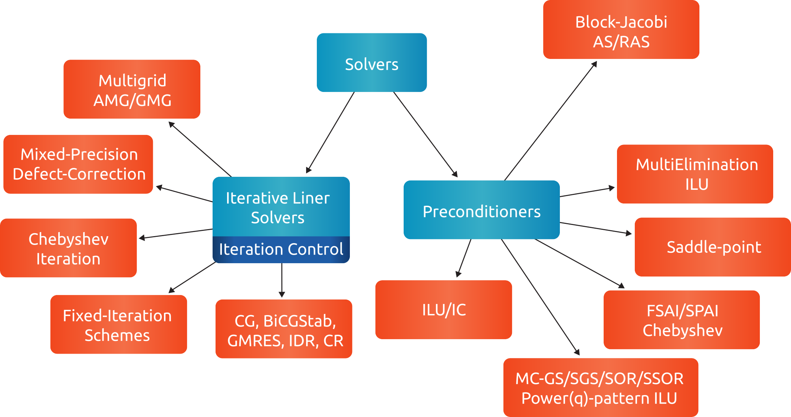

.. _rocalution_solprec:

***************************
Solvers and Preconditioners
***************************

Most of the solvers can be performed on linear operators, e.g. :cpp:class:`rocalution::LocalMatrix`, :cpp:class:`rocalution::LocalStencil` and :cpp:class:`rocalution::GlobalMatrix` - i.e. the solvers can be performed locally (on a shared memory system) or in a distributed manner (on a cluster) via MPI.
All solvers and preconditioners need three template parameters - Operators, Vectors and Scalar type.
The Solver class is purely virtual and provides an interface for

- :cpp:func:`rocalution::Solver::SetOperator` to set the operator, i.e. the user can pass the matrix here.
- :cpp:func:`rocalution::Solver::Build` to build the solver (including preconditioners, sub-solvers, etc.).
  The user need to specify the operator first before building the solver.
- :cpp:func:`rocalution::Solver::Solve` to solve the sparse linear system.
  The user need to pass a right-hand side and a solution / initial guess vector.
- :cpp:func:`rocalution::Solver::Print` to show solver information.
- :cpp:func:`rocalution::Solver::ReBuildNumeric` to only re-build the solver numerically (if possible).
- :cpp:func:`rocalution::Solver::MoveToHost` and :cpp:func:`rocalution::Solver::MoveToAccelerator` to offload the solver (including preconditioners and sub-solvers) to the host / accelerator.

.. _solvers:

   Solver and preconditioner classes.
