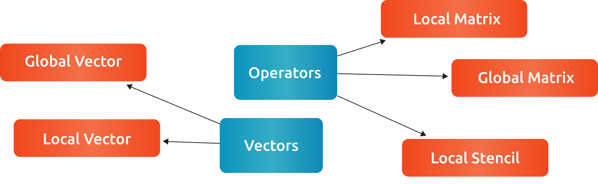
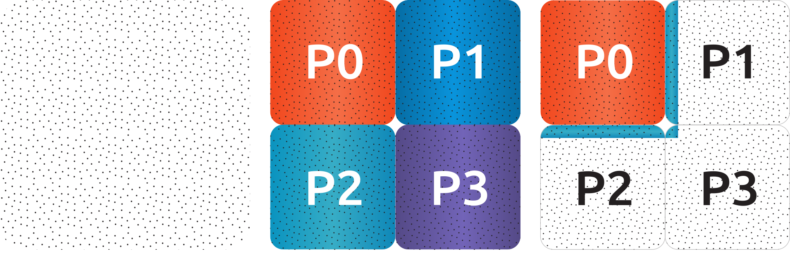
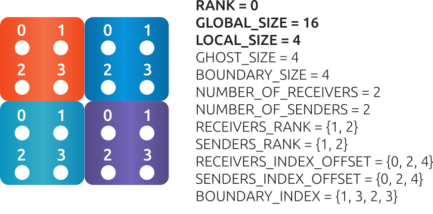
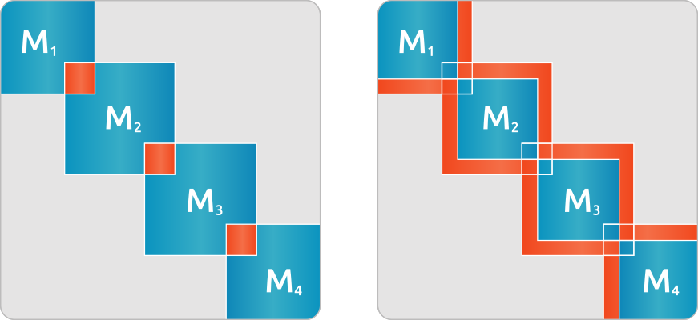

.. toctree::
   :maxdepth: 4 
   :caption: Contents:

.. |br| raw:: html

  <br />

==========
rocALUTION
==========

Introduction
------------

Overview
********
rocALUTION is a sparse linear algebra library with focus on exploring fine-grained parallelism, targeting modern processors and accelerators including multi/many-core CPU and GPU platforms. The main goal of this package is to provide a portable library for iterative sparse methods on state of the art hardware. rocALUTION can be seen as middle-ware between different parallel backends and application specific packages.

The major features and characteristics of the library are

* Various backends
    * Host - fallback backend, designed for CPUs
    * GPU/HIP - accelerator backend, designed for HIP capable AMD GPUs
    * OpenMP - designed for multi-core CPUs
    * MPI - designed for multi-node and multi-GPU configurations
* Easy to use
    The syntax and structure of the library provide easy learning curves. With the help of the examples, anyone can try out the library - no knowledge in HIP, OpenMP or MPI programming required.
* No special hardware requirements
    There are no hardware requirements to install and run rocALUTION. If a GPU device and HIP is available, the library will use them.
* Variety of iterative solvers
    * Fixed-Point iteration - Jacobi, Gauss-Seidel, Symmetric-Gauss Seidel, SOR and SSOR
    * Krylov subspace methods - CR, CG, BiCGStab, BiCGStab(l), GMRES, IDR, QMRCGSTAB, Flexible CG/GMRES
    * Mixed-precision defect-correction scheme
    * Chebyshev iteration
    * Multiple MultiGrid schemes, geometric and algebraic
* Various preconditioners
    * Matrix splitting - Jacobi, (Multi-colored) Gauss-Seidel, Symmetric Gauss-Seidel, SOR, SSOR
    * Factorization - ILU(0), ILU(p) (based on levels), ILU(p,q) (power(q)-pattern method), Multi-Elimination ILU (nested/recursive), ILUT (based on threshold) and IC(0)
    * Approximate Inverse - Chebyshev matrix-valued polynomial, SPAI, FSAI and TNS
    * Diagonal-based preconditioner for Saddle-point problems
    * Block-type of sub-preconditioners/solvers
    * Additive Schwarz and Restricted Additive Schwarz
    * Variable type preconditioners
* Generic and robust design
    rocALUTION is based on a generic and robust design allowing expansion in the direction of new solvers and preconditioners and support for various hardware types. Furthermore, the design of the library allows the use of all solvers as preconditioners in other solvers. For example you can easily define a CG solver with a Multi-Elimination preconditioner, where the last-block is preconditioned with another Chebyshev iteration method which is preconditioned with a multi-colored Symmetric Gauss-Seidel scheme.
* Portable code and results
    All code based on rocALUTION is portable and independent of HIP or OpenMP. The code will compile and run everywhere. All solvers and preconditioners are based on a single source code, which delivers portable results across all supported backends (variations are possible due to different rounding modes on the hardware). The only difference which you can see for a hardware change is the performance variation.
* Support for several sparse matrix formats
    Compressed Sparse Row (CSR), Modified Compressed Sparse Row (MCSR), Dense (DENSE), Coordinate (COO), ELL, Diagonal (DIA), Hybrid format of ELL and COO (HYB).

The code is open-source under MIT license and hosted on here: https://github.com/ROCmSoftwarePlatform/rocALUTION

.. _rocalution_contributing:

Contributing
*************

Contribution License Agreement
```````````````````````````````

#. The code I am contributing is mine, and I have the right to license it.
#. By submitting a pull request for this project I am granting you a license to distribute said code under the MIT License for the project.

How to contribute
``````````````````
Our code contriubtion guidelines closely follows the model of GitHub pull-requests. This repository follows the git flow workflow, which dictates a /master branch where releases are cut, and a /develop branch which serves as an integration branch for new code.

A `git extention <https://github.com/nvie/gitflow>`_ has been developed to ease the use of the 'git flow' methodology, but requires manual installation by the user. Please refer to the projects wiki.

Pull-request guidelines
````````````````````````
* Target the **develop** branch for integration.
* Ensure code builds successfully.
* Do not break existing test cases
* New functionality will only be merged with new unit tests.

  * New unit tests should integrate within the existing `googletest framework <https://github.com/google/googletest/blob/master/googletest/docs/primer.md>`_.
  * Tests must have good code coverage.
  * Code must also have benchmark tests, and performance must approach the compute bound limit or memory bound limit.

StyleGuide
```````````
This project follows the `CPP Core guidelines <https://github.com/isocpp/CppCoreGuidelines/blob/master/CppCoreGuidelines.md>`_, with few modifications or additions noted below. All pull-requests should in good faith attempt to follow the guidelines stated therein, but we recognize that the content is lengthy. Below we list our primary concerns when reviewing pull-requests.

**Interface**

* All public APIs are C89 compatible; all other library code should use C++14.
* Our minimum supported compiler is clang 3.6.
* Avoid CamelCase.
* This rule applies specifically to publicly visible APIs, but is also encouraged (not mandated) for internal code.

**Philosophy**

* `P.2 <https://github.com/isocpp/CppCoreGuidelines/blob/master/CppCoreGuidelines.md#Rp-Cplusplus>`_: Write in ISO Standard C++ (especially to support Windows, Linux and MacOS platforms).
* `P.5 <https://github.com/isocpp/CppCoreGuidelines/blob/master/CppCoreGuidelines.md#Rp-compile-time>`_: Prefer compile-time checking to run-time checking.

**Implementation**

* `SF.1 <https://github.com/isocpp/CppCoreGuidelines/blob/master/CppCoreGuidelines.md#Rs-file-suffix>`_: Use a .cpp suffix for code files and .h for interface files if your project doesn't already follow another convention.
* We modify this rule:

  * .h: C header files.
  * .hpp: C++ header files.

* `SF.5 <https://github.com/isocpp/CppCoreGuidelines/blob/master/CppCoreGuidelines.md#Rs-consistency>`_: A .cpp file must include the .h file(s) that defines its interface.
* `SF.7 <https://github.com/isocpp/CppCoreGuidelines/blob/master/CppCoreGuidelines.md#Rs-using-directive>`_: Don't put a using-directive in a header file.
* `SF.8 <https://github.com/isocpp/CppCoreGuidelines/blob/master/CppCoreGuidelines.md#Rs-guards>`_: Use #include guards for all .h files.
* `SF.21 <https://github.com/isocpp/CppCoreGuidelines/blob/master/CppCoreGuidelines.md#Rs-unnamed>`_: Don't use an unnamed (anonymous) namespace in a header.
* `SL.10 <https://github.com/isocpp/CppCoreGuidelines/blob/master/CppCoreGuidelines.md#Rsl-arrays>`_: Prefer using STL array or vector instead of a C array.
* `C.9 <https://github.com/isocpp/CppCoreGuidelines/blob/master/CppCoreGuidelines.md#Rc-private>`_: Minimize exposure of members.
* `F.3 <https://github.com/isocpp/CppCoreGuidelines/blob/master/CppCoreGuidelines.md#Rf-single>`_: Keep functions short and simple.
* `F.21 <https://github.com/isocpp/CppCoreGuidelines/blob/master/CppCoreGuidelines.md#Rf-out-multi>`_: To return multiple 'out' values, prefer returning a tuple.
* `R.1 <https://github.com/isocpp/CppCoreGuidelines/blob/master/CppCoreGuidelines.md#Rr-raii>`_: Manage resources automatically using RAII (this includes unique_ptr & shared_ptr).
* `ES.11 <https://github.com/isocpp/CppCoreGuidelines/blob/master/CppCoreGuidelines.md#Res-auto>`_:  Use auto to avoid redundant repetition of type names.
* `ES.20 <https://github.com/isocpp/CppCoreGuidelines/blob/master/CppCoreGuidelines.md#Res-always>`_: Always initialize an object.
* `ES.23 <https://github.com/isocpp/CppCoreGuidelines/blob/master/CppCoreGuidelines.md#Res-list>`_: Prefer the {} initializer syntax.
* `ES.49 <https://github.com/isocpp/CppCoreGuidelines/blob/master/CppCoreGuidelines.md#Res-casts-named>`_: If you must use a cast, use a named cast.
* `CP.1 <https://github.com/isocpp/CppCoreGuidelines/blob/master/CppCoreGuidelines.md#S-concurrency>`_: Assume that your code will run as part of a multi-threaded program.
* `I.2 <https://github.com/isocpp/CppCoreGuidelines/blob/master/CppCoreGuidelines.md#Ri-global>`_: Avoid global variables.

**Format**

C and C++ code is formatted using clang-format. To format a file, use

::

  clang-format-3.8 -style=file -i <file>

To format all files, run the following script in rocALUTION directory:

::

  #!/bin/bash

  find . -iname '*.h' \
  -o -iname '*.hpp' \
  -o -iname '*.cpp' \
  -o -iname '*.h.in' \
  -o -iname '*.hpp.in' \
  -o -iname '*.cpp.in' \
  -o -iname '*.cl' \
  | grep -v 'build' \
  | xargs -n 1 -P 8 -I{} clang-format-3.8 -style=file -i {}

Also, githooks can be installed to format the code per-commit:

::

  ./.githooks/install

Building and Installing
-----------------------

Installing from AMD ROCm repositories
**************************************
TODO, not yet available

Building rocALUTION from Open-Source repository
***********************************************

Download rocALUTION
```````````````````
The rocALUTION source code is available at the `rocALUTION github page <https://github.com/ROCmSoftwarePlatform/rocALUTION>`_.
Download the master branch using:

::

  git clone -b master https://github.com/ROCmSoftwarePlatform/rocALUTION.git
  cd rocALUTION


Note that if you want to contribute to rocALUTION, you will need to checkout the develop branch instead of the master branch. See :ref:`rocalution_contributing` for further details.
Below are steps to build different packages of the library, including dependencies and clients.
It is recommended to install rocALUTION using the *install.sh* script.

Using *install.sh* to build dependencies + library
```````````````````````````````````````````````````
The following table lists common uses of *install.sh* to build dependencies + library. Accelerator support via HIP and OpenMP will be enabled by default, whereas MPI is disabled.

===================== ====
Command               Description
===================== ====
`./install.sh -h`     Print help information.
`./install.sh -d`     Build dependencies and library in your local directory. The `-d` flag only needs to be |br| used once. For subsequent invocations of *install.sh* it is not necessary to rebuild the |br| dependencies.
`./install.sh`        Build library in your local directory. It is assumed dependencies are available.
`./install.sh -i`     Build library, then build and install rocALUTION package in `/opt/rocm/rocalution`. You will |br| be prompted for sudo access. This will install for all users.
`./install.sh --host` Build library in your local directory without HIP support. It is assumed dependencies |br| are available.
`./install.sh --mpi`  Build library in your local directory with HIP and MPI support. It is assumed |br| dependencies are available.
===================== ====

Using *install.sh* to build dependencies + library + client
````````````````````````````````````````````````````````````
The client contains example code, unit tests and benchmarks. Common uses of *install.sh* to build them are listed in the table below.

=================== ====
Command             Description
=================== ====
`./install.sh -h`   Print help information.
`./install.sh -dc`  Build dependencies, library and client in your local directory. The `-d` flag only needs to |br| be used once. For subsequent invocations of *install.sh* it is not necessary to rebuild the |br| dependencies.
`./install.sh -c`   Build library and client in your local directory. It is assumed dependencies are available.
`./install.sh -idc` Build library, dependencies and client, then build and install rocALUTION package in |br| `/opt/rocm/rocalution`. You will be prompted for sudo access. This will install for all users.
`./install.sh -ic`  Build library and client, then build and install rocALUTION package in |br| `opt/rocm/rocalution`. You will be prompted for sudo access. This will install for all users.
=================== ====

Using individual commands to build rocALUTION
`````````````````````````````````````````````
CMake 3.5 or later is required in order to build rocALUTION.

rocALUTION can be built with cmake using the following commands:

::

  # Create and change to build directory
  mkdir -p build/release ; cd build/release

  # Default install path is /opt/rocm, use -DCMAKE_INSTALL_PREFIX=<path> to adjust it
  cmake ../.. -DSUPPORT_HIP=ON \
              -DSUPPORT_MPI=OFF \
              -DSUPPORT_OMP=ON

  # Compile rocALUTION library
  make -j$(nproc)

  # Install rocALUTION to /opt/rocm
  sudo make install

GoogleTest is required in order to build rocALUTION client.

rocALUTION with dependencies and client can be built using the following commands:

::

  # Install googletest
  mkdir -p build/release/deps ; cd build/release/deps
  cmake ../../../deps
  sudo make -j$(nproc) install

  # Change to build directory
  cd ..

  # Default install path is /opt/rocm, use -DCMAKE_INSTALL_PREFIX=<path> to adjust it
  cmake ../.. -DBUILD_CLIENTS_TESTS=ON \
              -DBUILD_CLIENTS_SAMPLES=ON

  # Compile rocALUTION library
  make -j$(nproc)

  # Install rocALUTION to /opt/rocm
  sudo make install

The compilation process produces a shared library file *librocalution.so* and *librocalution_hip.so* if HIP support is enabled. Ensure that the library objects can be found in your library path. If you do not copy the library to a specific location you can add the path under Linux in the *LD_LIBRARY_PATH* variable.

::

  export LD_LIBRARY_PATH=$LD_LIBRARY_PATH:<path_to_rocalution>

Common build problems
``````````````````````
#. **Issue:** HIP (/opt/rocm/hip) was built using hcc 1.0.xxx-xxx-xxx-xxx, but you are using /opt/rocm/bin/hcc with version 1.0.yyy-yyy-yyy-yyy from hipcc (version mismatch). Please rebuild HIP including cmake or update HCC_HOME variable.

   **Solution:** Download HIP from github and use hcc to `build from source <https://github.com/ROCm-Developer-Tools/HIP/blob/master/INSTALL.md>`_ and then use the built HIP instead of /opt/rocm/hip.

#. **Issue:** For Carrizo - HCC RUNTIME ERROR: Failed to find compatible kernel

   **Solution:** Add the following to the cmake command when configuring: `-DCMAKE_CXX_FLAGS="--amdgpu-target=gfx801"`

#. **Issue:** For MI25 (Vega10 Server) - HCC RUNTIME ERROR: Failed to find compatible kernel

   **Solution:** `export HCC_AMDGPU_TARGET=gfx900`

#. **Issue:** Could not find a package configuration file provided by "ROCM" with any of the following names:
              ROCMConfig.cmake |br|
              rocm-config.cmake

   **Solution:** Install `ROCm cmake modules <https://github.com/RadeonOpenCompute/rocm-cmake>`_

#. **Issue:** Could not find a package configuration file provided by "ROCSPARSE" with any of the following names:
              ROCSPARSE.cmake |br|
              rocsparse-config.cmake

   **Solution:** Install `rocSPARSE <https://github.com/ROCmSoftwarePlatform/rocSPARSE>`_

#. **Issue:** Could not find a package configuration file provided by "ROCBLAS" with any of the following names:
              ROCBLAS.cmake |br|
              rocblas-config.cmake

   **Solution:** Install `rocBLAS <https://github.com/ROCmSoftwarePlatform/rocBLAS>`_

Simple Test
***********
You can test the installation by running a CG solver on a Laplace matrix. After compiling the library you can perform the CG solver test by executing

::

  cd rocALUTION/build/release/examples

  wget ftp://math.nist.gov/pub/MatrixMarket2/Harwell-Boeing/laplace/gr_30_30.mtx.gz
  gzip -d gr_30_30.mtx.gz

  ./cg gr_30_30.mtx

Basics
------

Design and Philosophy
*********************
The main idea of the rocALUTION objects is that they are separated from the actual hardware specification. Once you declare a matrix, a vector or a solver they are initially allocated on the host (CPU). Then, every object can be moved to a selected accelerator by a simple :cpp:func:`rocalution::BaseRocalution::MoveToAccelerator` function. The whole execution mechanism is based on run-time type information (RTTI), which allows you to select where and how you want to perform the operations at run time. This is in contrast to the template-based libraries, which need this information at compile time.

The philosophy of the library is to abstract the hardware-specific functions and routines from the actual program, that describes the algorithm. It is hard and almost impossible for most of the large simulation software based on sparse computation, to adapt and port their implementation in order to use every new technology. On the other hand, the new high performance accelerators and devices have the capability to decrease the computational time significantly in many critical parts.

This abstraction layer of the hardware specific routines is the core of the rocALUTION design. It is built to explore fine-grained level of parallelism suited for multi/many-core devices. This is in contrast to most of the parallel sparse libraries available which are mainly based on domain decomposition techniques. Thus, the design of the iterative solvers the preconditioners is very different. Another cornerstone of rocALUTION is the native support of accelerators - the memory allocation, transfers and specific hardware functions are handled internally in the library.

rocALUTION helps you to use accelerator technologies but does not force you to use them. Even if you offload your algorithms and solvers to the accelerator device, the same source code can be compiled and executed in a system without any accelerators.

Operators and Vectors
*********************
The main objects in rocALUTION are linear operators and vectors. All objects can be moved to an accelerator at run time. The linear operators are defined as local or global matrices (i.e. on a single node or distributed/multi-node) and local stencils (i.e. matrix-free linear operations). The only template parameter of the operators and vectors is the data type (ValueType). The operator data type could be float, double, complex float or complex double, while the vector data type can be int, float, double, complex float or complex double (int is used mainly for the permutation vectors). In the current version, cross ValueType object operations are not supported. :numref:`operators` gives an overview of supported operators and vectors.

.. _operators:


  Operator and vector classes.

Each of the objects contain a local copy of the hardware descriptor created by the :cpp:func:`rocalution::init_rocalution` function. This allows the user to modify it according to his needs and to obtain two or more objects with different hardware specifications (e.g. different amount of OpenMP threads, HIP block sizes, etc.).

Local Operators and Vectors
```````````````````````````
By Local Operators and Vectors we refer to Local Matrices and Stencils and to Local Vectors. By Local we mean the fact that they stay on a single system. The system can contain several CPUs via UMA or NUMA memory system, it can also contain an accelerator.

.. doxygenclass:: rocalution::LocalMatrix
.. doxygenclass:: rocalution::LocalStencil
.. doxygenclass:: rocalution::LocalVector

Global Operators and Vectors
````````````````````````````
By Global Operators and Vectors we refer to Global Matrix and to Global Vectors. By Global we mean the fact they can stay on a single or multiple nodes in a network. For this type of computation, the communication is based on MPI.

.. doxygenclass:: rocalution::GlobalMatrix
.. doxygenclass:: rocalution::GlobalVector

Functionality on the Accelerator
********************************
Naturally, not all routines and algorithms can be performed efficiently on many-core systems (i.e. on accelerators). To provide full functionality, the library has internal mechanisms to check if a particular routine is implemented on the accelerator. If not, the object is moved to the host and the routine is computed there. This guarantees that your code will run (maybe not in the most efficient way) with any accelerator regardless of the available functionality for it.

Initialization of rocALUTION
****************************
The body of a rocALUTION code is very simple, it should contain the header file and the namespace of the library. The program must contain an initialization call, which will check and allocate the hardware and a finalizing call which will release the allocated hardware.

.. doxygenfunction:: rocalution::init_rocalution
.. doxygenfunction:: rocalution::stop_rocalution

Thread-core Mapping
```````````````````
.. doxygenfunction:: rocalution::set_omp_threads_rocalution
.. doxygenfunction:: rocalution::set_omp_affinity_rocalution

OpenMP Threshold Size
`````````````````````
.. doxygenfunction:: rocalution::set_omp_threshold_rocalution

Accelerator Selection
`````````````````````
.. doxygenfunction:: rocalution::set_device_rocalution

Disable the Accelerator
```````````````````````
.. doxygenfunction:: rocalution::disable_accelerator_rocalution

Backend Information
```````````````````
.. doxygenfunction:: rocalution::info_rocalution(void)
.. doxygenfunction:: rocalution::info_rocalution(const struct Rocalution_Backend_Descriptor)

MPI and Multi-Accelerators
``````````````````````````
When initializing the library with MPI, the user need to pass the rank of the MPI process as well as the number of accelerators available on each node. Basically, this way the user can specify the mapping of MPI
process and accelerators - the allocated accelerator will be `rank % num_dev_per_node`. Thus, the user can run two MPI processes on systems with two accelerators by specifying the number of devices to 2.

.. code-block:: cpp

  #include <rocalution.hpp>
  #include <mpi.h>

  using namespace rocalution;

  int main(int argc, char* argv[])
  {
      MPI_Init(&argc, &argv);
      MPI_Comm comm = MPI_COMM_WORLD;

      int num_processes;
      int rank;

      MPI_Comm_size(comm, &num_processes);
      MPI_Comm_rank(comm, &rank);

      int nacc_per_node = 2;

      init_rocalution(rank, nacc_per_node);

      // ...

      stop_rocalution();

      return 0;
  }

Automatic Object Tracking
*************************
By default, after the initialization of the library, rocALUTION tracks all objects and releasing the allocated memory in them when the library is stopped. This ensure large memory leaks when the objects are allocated but not freed. The user can disable the tracking by editing `src/utils/def.hpp`, however, this is not recommended.

Verbose Output
**************
rocALUTION provides different levels of output messages. They can be modified in `src/utils/def.hpp` before the compilation of the library. By setting a higher level, the user will obtain more detailed information about the internal calls and data transfers to and from the accelerators.

Verbose Output and MPI
**********************
To prevent all MPI processes from printing information to screen, the default configuration is that only RANK 0 outputs information. The user can change the RANK or allow all RANKs to print by modifying `src/utils/def.hpp`. If file logging is enabled, all ranks write into the corresponding log files.

Debug Output
************
Debug output will print almost every detail in the program, including object constructor / destructor, address of the object, memory allocation, data transfers, all function calls for matrices, vectors, solvers and preconditioners. The debug flag can be set in `src/utils/def.hpp`. When enabled, additional *assert()s* are being checked during the computation. This might decrease the performance of some operations significantly.

Logging
*******
TODO

.. _rocalution_version:

Versions
********
For checking the rocALUTION version in your code, you can use the pre-defined macros.

.. code-block:: cpp

  #define __ROCALUTION_VER_MAJOR  // version major
  #define __ROCALUTION_VER_MINOR  // version minor
  #define __ROCALUTION_VER_PATCH  // version patch

  #define __ROCALUTION_VER_PRE    // version pre-release (alpha or beta)

  #define __ROCALUTION_VER        // version

The final *__ROCALUTION_VER* gives the version number as `10000 * major + 100 * minor + patch`, see `src/base/version.hpp.in`.

Single-node Computation
-----------------------

Introduction
************
In this chapter, all base objects (matrices, vectors and stencils) for computation on a single-node (shared-memory) system are described. A typical configuration is illustrated in :numref:`single-node`.

.. _single-node:
.. figure:: ../fig/single-node.png
  :alt: single-node system configuration
  :align: center

  A typical single-node configuration, where gray boxes represent the cores, blue boxes represent the memory and arrows represent the bandwidth.

The compute node contains none, one or more accelerators. The compute node could be any kind of shared-memory (single, dual, quad CPU) system.

.. note:: The host and accelerator memory can be physically different.

Code Structure
**************
The `Data` is an object, pointing to the BaseMatrix class. The pointing is coming from either a HostMatrix or an AcceleratorMatrix. The AcceleratorMatrix is created by an object with an implementation in the backend and a matrix format. Switching between host and accelerator matrices is performed in the LocalMatrix class. The LocalVector is organized in the same way.

Each matrix format has its own class for the host and for the accelerator backend. All matrix classes are derived from the BaseMatrix, which provides the base interface for computation as well as for data accessing.

ValueType
*********
The value (data) type of the vectors and the matrices is defined as a template. The matrix can be of type float (32-bit), double (64-bit) and complex (64/128-bit). The vector can be float (32-bit), double (64-bit), complex (64/128-bit) and int (32/64-bit). The information about the precision of the data type is shown in the :cpp:func:`rocalution::BaseRocalution::Info` function.

Complex Support
***************
Currently, rocALUTION does not support complex computation.

Allocation and Free
*******************
.. doxygenfunction:: rocalution::LocalVector::Allocate
.. doxygenfunction:: rocalution::LocalVector::Clear
.. doxygenfunction:: rocalution::LocalMatrix::AllocateCOO
  :outline:
.. doxygenfunction:: rocalution::LocalMatrix::AllocateCSR
  :outline:
.. doxygenfunction:: rocalution::LocalMatrix::AllocateBCSR
  :outline:
.. doxygenfunction:: rocalution::LocalMatrix::AllocateMCSR
  :outline:
.. doxygenfunction:: rocalution::LocalMatrix::AllocateELL
  :outline:
.. doxygenfunction:: rocalution::LocalMatrix::AllocateDIA
  :outline:
.. doxygenfunction:: rocalution::LocalMatrix::AllocateHYB
  :outline:
.. doxygenfunction:: rocalution::LocalMatrix::AllocateDENSE

.. note:: More detailed information on the additional parameters required for matrix allocation is given in :ref:`matrix_formats`.
.. doxygenfunction:: rocalution::LocalMatrix::Clear

.. _matrix_formats:

Matrix Formats
**************
Matrices, where most of the elements are equal to zero, are called sparse. In most practical applications, the number of non-zero entries is proportional to the size of the matrix (e.g. typically, if the matrix :math:`A \in \mathbb{R}^{N \times N}`, then the number of elements are of order :math:`O(N)`). To save memory, storing zero entries can be avoided by introducing a structure corresponding to the non-zero elements of the matrix. rocALUTION supports sparse CSR, MCSR, COO, ELL, DIA, HYB and dense matrices (DENSE).

.. note:: The functionality of every matrix object is different and depends on the matrix format. The CSR format provides the highest support for various functions. For a few operations, an internal conversion is performed, however, for many routines an error message is printed and the program is terminated.
.. note:: In the current version, some of the conversions are performed on the host (disregarding the actual object allocation - host or accelerator).

.. code-block:: cpp

  // Convert mat to CSR storage format
  mat.ConvertToCSR();
  // Perform a matrix-vector multiplication y = mat * x in CSR format
  mat.Apply(x, &y);

  // Convert mat to ELL storage format
  mat.ConvertToELL();
  // Perform a matrix-vector multiplication y = mat * x in ELL format
  mat.Apply(x, &y);

.. code-block:: cpp

  // Convert mat to CSR storage format
  mat.ConvertTo(CSR);
  // Perform a matrix-vector multiplication y = mat * x in CSR format
  mat.Apply(x, &y);

  // Convert mat to ELL storage format
  mat.ConvertTo(ELL);
  // Perform a matrix-vector multiplication y = mat * x in ELL format
  mat.Apply(x, &y);

COO storage format
``````````````````
The most intuitive sparse format is the coordinate format (COO). It represents the non-zero elements of the matrix by their coordinates and requires two index arrays (one for row and one for column indexing) and the values array. A :math:`m \times n` matrix is represented by

=========== ==================================================================
m           number of rows (integer).
n           number of columns (integer).
nnz         number of non-zero elements (integer).
coo_val     array of ``nnz`` elements containing the data (floating point).
coo_row_ind array of ``nnz`` elements containing the row indices (integer).
coo_col_ind array of ``nnz`` elements containing the column indices (integer).
=========== ==================================================================

.. note:: The COO matrix is expected to be sorted by row indices and column indices per row. Furthermore, each pair of indices should appear only once.

Consider the following :math:`3 \times 5` matrix and the corresponding COO structures, with :math:`m = 3, n = 5` and :math:`\text{nnz} = 8`:

.. math::

  A = \begin{pmatrix}
        1.0 & 2.0 & 0.0 & 3.0 & 0.0 \\
        0.0 & 4.0 & 5.0 & 0.0 & 0.0 \\
        6.0 & 0.0 & 0.0 & 7.0 & 8.0 \\
      \end{pmatrix}

where

.. math::

  \begin{array}{ll}
    \text{coo_val}[8] & = \{1.0, 2.0, 3.0, 4.0, 5.0, 6.0, 7.0, 8.0\} \\
    \text{coo_row_ind}[8] & = \{0, 0, 0, 1, 1, 2, 2, 2\} \\
    \text{coo_col_ind}[8] & = \{0, 1, 3, 1, 2, 0, 3, 4\}
  \end{array}

CSR storage format
``````````````````
One of the most popular formats in many scientific codes is the compressed sparse row (CSR) format. In this format, instead of row indices, the row offsets to the beginning of each row are stored. Thus, each row elements can be accessed sequentially. However, this format does not allow sequential accessing of the column entries.
The CSR storage format represents a :math:`m \times n` matrix by

=========== =========================================================================
m           number of rows (integer).
n           number of columns (integer).
nnz         number of non-zero elements (integer).
csr_val     array of ``nnz`` elements containing the data (floating point).
csr_row_ptr array of ``m+1`` elements that point to the start of every row (integer).
csr_col_ind array of ``nnz`` elements containing the column indices (integer).
=========== =========================================================================

.. note:: The CSR matrix is expected to be sorted by column indices within each row. Furthermore, each pair of indices should appear only once.

Consider the following :math:`3 \times 5` matrix and the corresponding CSR structures, with :math:`m = 3, n = 5` and :math:`\text{nnz} = 8`:

.. math::

  A = \begin{pmatrix}
        1.0 & 2.0 & 0.0 & 3.0 & 0.0 \\
        0.0 & 4.0 & 5.0 & 0.0 & 0.0 \\
        6.0 & 0.0 & 0.0 & 7.0 & 8.0 \\
      \end{pmatrix}

where

.. math::

  \begin{array}{ll}
    \text{csr_val}[8] & = \{1.0, 2.0, 3.0, 4.0, 5.0, 6.0, 7.0, 8.0\} \\
    \text{csr_row_ptr}[4] & = \{0, 3, 5, 8\} \\
    \text{csr_col_ind}[8] & = \{0, 1, 3, 1, 2, 0, 3, 4\}
  \end{array}

ELL storage format
``````````````````
The Ellpack-Itpack (ELL) storage format can be seen as a modification of the CSR format without row offset pointers. Instead, a fixed number of elements per row is stored.
It represents a :math:`m \times n` matrix by

=========== ================================================================================
m           number of rows (integer).
n           number of columns (integer).
ell_width   maximum number of non-zero elements per row (integer)
ell_val     array of ``m times ell_width`` elements containing the data (floating point).
ell_col_ind array of ``m times ell_width`` elements containing the column indices (integer).
=========== ================================================================================

.. note:: The ELL matrix is assumed to be stored in column-major format. Rows with less than ``ell_width`` non-zero elements are padded with zeros (``ell_val``) and :math:`-1` (``ell_col_ind``).

Consider the following :math:`3 \times 5` matrix and the corresponding ELL structures, with :math:`m = 3, n = 5` and :math:`\text{ell_width} = 3`:

.. math::

  A = \begin{pmatrix}
        1.0 & 2.0 & 0.0 & 3.0 & 0.0 \\
        0.0 & 4.0 & 5.0 & 0.0 & 0.0 \\
        6.0 & 0.0 & 0.0 & 7.0 & 8.0 \\
      \end{pmatrix}

where

.. math::

  \begin{array}{ll}
    \text{ell_val}[9] & = \{1.0, 4.0, 6.0, 2.0, 5.0, 7.0, 3.0, 0.0, 8.0\} \\
    \text{ell_col_ind}[9] & = \{0, 1, 0, 1, 2, 3, 3, -1, 4\}
  \end{array}

.. _DIA storage format:

DIA storage format
``````````````````
If all (or most) of the non-zero entries belong to a few diagonals of the matrix, they can be stored with the corresponding offsets. The values in DIA format are stored as array with size :math:`D \times N_D`, where :math:`D` is the number of diagonals in the matrix and :math:`N_D` is the number of elements in the main diagonal. Since not all values in this array are occupied, the not accessible entries are denoted with :math:`\ast`. They correspond to the offsets in the diagonal array (negative values represent offsets from the beginning of the array).
The DIA storage format represents a :math:`m \times n` matrix by

========== ====
m          number of rows (integer)
n          number of columns (integer)
ndiag      number of occupied diagonals (integer)
dia_offset array of ``ndiag`` elements containing the offset with respect to the main diagonal (integer).
dia_val	   array of ``m times ndiag`` elements containing the values (floating point).
========== ====

Consider the following :math:`5 \times 5` matrix and the corresponding DIA structures, with :math:`m = 5, n = 5` and :math:`\text{ndiag} = 4`:

.. math::

  A = \begin{pmatrix}
        1 & 2 & 0 & 11 & 0 \\
        0 & 3 & 4 & 0 & 0 \\
        0 & 5 & 6 & 7 & 0 \\
        0 & 0 & 0 & 8 & 0 \\
        0 & 0 & 0 & 9 & 10
      \end{pmatrix}

where

.. math::

  \begin{array}{ll}
    \text{dia_val}[20] & = \{\ast, 0, 5, 0, 9, 1, 3, 6, 8, 10, 2, 4, 7, 0, \ast, 11, 0, \ast, \ast, \ast\} \\
    \text{dia_offset}[4] & = \{-1, 0, 1, 3\}
  \end{array}

.. _HYB storage format:

HYB storage format
``````````````````
The DIA and ELL formats cannot represent efficiently completely unstructured sparse matrices. To keep the memory footprint low, DIA requires the elements to belong to a few diagonals and ELL needs a fixed number of elements per row. For many applications this is a too strong restriction. A solution to this issue is to represent the more regular part of the matrix in such a format and the remaining part in COO format. The HYB format is a mixture between ELL and COO, where the maximum elements per row for the ELL part is computed by `nnz/m`. It represents a :math:`m \times n` matrix by

=========== =========================================================================================
m           number of rows (integer).
n           number of columns (integer).
nnz         number of non-zero elements of the COO part (integer)
ell_width   maximum number of non-zero elements per row of the ELL part (integer)
ell_val     array of ``m times ell_width`` elements containing the ELL part data (floating point).
ell_col_ind array of ``m times ell_width`` elements containing the ELL part column indices (integer).
coo_val     array of ``nnz`` elements containing the COO part data (floating point).
coo_row_ind array of ``nnz`` elements containing the COO part row indices (integer).
coo_col_ind array of ``nnz`` elements containing the COO part column indices (integer).
=========== =========================================================================================

For further details on matrix formats, see :cite:`SAAD`.

Memory Usage
````````````
The memory footprint of the different matrix formats is presented in the following table, considering a :math:`N \times N` matrix, where the number of non-zero entries is denoted with `nnz`.

====== =========================== =======
Format Structure                   Values
====== =========================== =======
DENSE                              :math:`N \times N`
COO    :math:`2 \times \text{nnz}` :math:`\text{nnz}`
CSR    :math:`N + 1 + \text{nnz}`  :math:`\text{nnz}`
ELL    :math:`M \times N`          :math:`M \times N`
DIA    :math:`D`                   :math:`D \times N_D`
====== =========================== =======

For the ELL matrix :math:`M` characterizes the maximal number of non-zero elements per row and for the DIA matrix, :math:`D` defines the number of diagonals and :math:`N_D` defines the size of the main diagonal.

File I/O
********
.. doxygenfunction:: rocalution::LocalVector::ReadFileASCII
.. doxygenfunction:: rocalution::LocalVector::WriteFileASCII
.. doxygenfunction:: rocalution::LocalVector::ReadFileBinary
.. doxygenfunction:: rocalution::LocalVector::WriteFileBinary
.. doxygenfunction:: rocalution::LocalMatrix::ReadFileMTX
.. doxygenfunction:: rocalution::LocalMatrix::WriteFileMTX
.. doxygenfunction:: rocalution::LocalMatrix::ReadFileCSR
.. doxygenfunction:: rocalution::LocalMatrix::WriteFileCSR

.. note:: To obtain the rocALUTION version, see :ref:`rocalution_version`.

For further details on the Matrix Market Format, see :cite:`mm`.

Access
******

.. doxygenfunction:: rocalution::LocalVector::operator[](int)
  :outline:
.. doxygenfunction:: rocalution::LocalVector::operator[](int) const

.. note:: Accessing elements via the *[]* operators is slow. Use this for debugging purposes only. There is no direct access to the elements of matrices due to the sparsity structure. Matrices can be imported by a copy function. For CSR matrices, this is :cpp:func:`rocalution::LocalMatrix::CopyFromCSR` and :cpp:func:`rocalution::LocalMatrix::CopyToCSR`.

.. code-block:: cpp

  // Allocate the CSR matrix
  int* csr_row_ptr   = new int[100 + 1];
  int* csr_col_ind   = new int[345];
  ValueType* csr_val = new ValueType[345];

  // Fill the CSR matrix
  // ...

  // rocALUTION local matrix object
  LocalMatrix<ValueType> mat;

  // Import CSR matrix to rocALUTION
  mat.AllocateCSR("my_matrix", 345, 100, 100);
  mat.CopyFromCSR(csr_row_ptr, csr_col, csr_val);

Raw Access to the Data
**********************

.. _SetDataPtr:

SetDataPtr
``````````
For vector and matrix objects, direct access to the raw data can be obtained via pointers. Already allocated data can be set with *SetDataPtr*. Setting data pointers will leave the original pointers empty.

.. doxygenfunction:: rocalution::LocalVector::SetDataPtr
.. doxygenfunction:: rocalution::LocalMatrix::SetDataPtrCOO
  :outline:
.. doxygenfunction:: rocalution::LocalMatrix::SetDataPtrCSR
  :outline:
.. doxygenfunction:: rocalution::LocalMatrix::SetDataPtrMCSR
  :outline:
.. doxygenfunction:: rocalution::LocalMatrix::SetDataPtrELL
  :outline:
.. doxygenfunction:: rocalution::LocalMatrix::SetDataPtrDIA
  :outline:
.. doxygenfunction:: rocalution::LocalMatrix::SetDataPtrDENSE

.. _LeaveDataPtr:

LeaveDataPtr
````````````
With *LeaveDataPtr*, the raw data from the object can be obtained. This will leave the object empty.

.. doxygenfunction:: rocalution::LocalVector::LeaveDataPtr
.. doxygenfunction:: rocalution::LocalMatrix::LeaveDataPtrCOO
  :outline:
.. doxygenfunction:: rocalution::LocalMatrix::LeaveDataPtrCSR
  :outline:
.. doxygenfunction:: rocalution::LocalMatrix::LeaveDataPtrMCSR
  :outline:
.. doxygenfunction:: rocalution::LocalMatrix::LeaveDataPtrELL
  :outline:
.. doxygenfunction:: rocalution::LocalMatrix::LeaveDataPtrDIA
  :outline:
.. doxygenfunction:: rocalution::LocalMatrix::LeaveDataPtrDENSE

.. note:: If the object is allocated on the host, then the pointers obtained from :ref:`SetDataPtr` and :ref:`LeaveDataPtr` will be on the host. If the vector object is on the accelerator, then the data pointers will be on the accelerator.
.. note:: If the object is moved to and from the accelerator, then the original pointer will be invalid.
.. note:: Never rely on old pointers, hidden object movement to and from the accelerator will make them invalid.
.. note:: Whenever you pass or obtain pointers to/from a rocALUTION object, you need to use the same memory allocation/free functions. Please check the source code for that (for host *src/utils/allocate_free.cpp* and for HIP *src/base/hip/hip_allocate_free.cpp*)

Copy CSR Matrix Host Data
*************************
.. doxygenfunction:: rocalution::LocalMatrix::CopyFromHostCSR

Copy Data
*********
The user can copy data to and from a local vector by using *CopyFromData()* *CopyToData()*.

.. doxygenfunction:: rocalution::LocalVector::CopyFromData
.. doxygenfunction:: rocalution::LocalVector::CopyToData

Object Info
***********
.. doxygenfunction:: rocalution::BaseRocalution::Info

Copy
****
All matrix and vector objects provide a *CopyFrom()* function. The destination object should have the same size or be empty. In the latter case, the object is allocated at the source platform.

.. doxygenfunction:: rocalution::LocalVector::CopyFrom(const LocalVector<ValueType>&)
.. doxygenfunction:: rocalution::LocalMatrix::CopyFrom

.. note:: For vectors, the user can specify source and destination offsets and thus copy only a part of the whole vector into another vector.

.. doxygenfunction:: rocalution::LocalVector::CopyFrom(const LocalVector<ValueType>&, int, int, int)

Clone
*****
The copy operators allow you to copy the values of the object to another object, without changing the backend specification of the object. In many algorithms, you might need auxiliary vectors or matrices. These objects can be cloned with CloneFrom().

CloneFrom
`````````
.. doxygenfunction:: rocalution::LocalVector::CloneFrom
.. doxygenfunction:: rocalution::LocalMatrix::CloneFrom

CloneBackend
````````````
.. doxygenfunction:: rocalution::BaseRocalution::CloneBackend(const BaseRocalution<ValueType>&)

Check
*****
.. doxygenfunction:: rocalution::LocalVector::Check
.. doxygenfunction:: rocalution::LocalMatrix::Check

Checks, if the object contains valid data. For vectors, the function checks if the values are not infinity and not NaN (not a number). For matrices, this function checks the values and if the structure of the matrix is correct (e.g. indices cannot be negative, CSR and COO matrices have to be sorted, etc.).

Sort
****
.. doxygenfunction:: rocalution::LocalMatrix::Sort

Keying
******
.. doxygenfunction:: rocalution::LocalMatrix::Key

Graph Analyzers
***************
The following functions are available for analyzing the connectivity in graph of the underlying sparse matrix.

* (R)CMK Ordering
* Maximal Independent Set
* Multi-Coloring
* Zero Block Permutation
* Connectivity Ordering

All graph analyzing functions return a permutation vector (integer type), which is supposed to be used with the :cpp:func:`rocalution::LocalMatrix::Permute` and :cpp:func:`rocalution::LocalMatrix::PermuteBackward` functions in the matrix and vector classes.

For further details, see :cite:`SAAD`.

Cuthill-McKee Ordering
``````````````````````
.. doxygenfunction:: rocalution::LocalMatrix::CMK
.. doxygenfunction:: rocalution::LocalMatrix::RCMK

Maximal Independent Set
```````````````````````
.. doxygenfunction:: rocalution::LocalMatrix::MaximalIndependentSet

Multi-Coloring
``````````````
.. doxygenfunction:: rocalution::LocalMatrix::MultiColoring

Zero Block Permutation
``````````````````````
.. doxygenfunction:: rocalution::LocalMatrix::ZeroBlockPermutation

Connectivity Ordering
`````````````````````
.. doxygenfunction:: rocalution::LocalMatrix::ConnectivityOrder

Basic Linear Algebra Operations
*******************************
For a full list of functions and routines involving operators and vectors, see the API specifications.

Multi-node Computation
----------------------

Introduction
************
This chapter describes all base objects (matrices and vectors) for computation on multi-node (distributed memory) systems.

.. _multi-node1:
.. figure:: ../fig/multi-node1.png
  :alt: multi-node system configuration
  :align: center

  An example for a multi-node configuration, where all nodes are connected via network. Single socket systems with a single accelerator.

.. figure:: ../fig/multi-node2.png
  :alt: multi-node system configuration
  :align: center

  An example for a multi-node configuration, where all nodes are connected via network. Dual socket systems with two accelerators attached to each node.

To each compute node, one or more accelerators can be attached. The compute node could be any kind of shared-memory (single, dual, quad CPU) system, details on a single-node can be found in :numref:`single-node`.

.. note:: The memory of accelerator and host are physically different. All nodes can communicate with each other via network.

For the communication channel between different nodes (and between the accelerators on single or multiple nodes) the MPI library is used.

rocALUTION supports non-overlapping type of distribution, where the computational domain is split into several sub-domain with the corresponding information about the boundary and ghost layers. An example is shown in :numref:`domain1`. The square box domain is distributed into four sub-domains. Each subdomain belongs to a process *P0*, *P1*, *P2* and *P3*.

.. _domain1:


  An example for domain distribution.

To perform a sparse matrix-vector multiplication (SpMV), each process need to multiply its own portion of the domain and update the corresponding ghost elements. For *P0*, this multiplication reads

.. math::

  Ax = y, \\
  A_I x_I + A_G x_G = y_I,

where :math:`I` stands for interior and :math:`G` stands for ghost. :math:`x_G` is a vector with three sections, coming from *P1*, *P2* and *P3*. The whole ghost part of the global vector is used mainly for the SpMV product. It does not play any role in the computation of vector-vector operations.

Code Structure
**************
Each object contains two local sub-objects. The global matrix stores interior and ghost matrix by local objects. Similarily, the global vector stores its data by two local objects. In addition to the local data, the global objects have information about the global communication through the parallel manager.

.. _global_objects:
.. figure:: ../fig/global_objects.png
  :alt: global matrices and vectors
  :align: center

  Global matrices and vectors.

Parallel Manager
****************
.. doxygenclass:: rocalution::ParallelManager

The parallel manager class hosts the following functions:

.. doxygenfunction:: rocalution::ParallelManager::SetMPICommunicator
.. doxygenfunction:: rocalution::ParallelManager::Clear
.. doxygenfunction:: rocalution::ParallelManager::GetGlobalSize
.. doxygenfunction:: rocalution::ParallelManager::GetLocalSize
.. doxygenfunction:: rocalution::ParallelManager::GetNumReceivers
.. doxygenfunction:: rocalution::ParallelManager::GetNumSenders
.. doxygenfunction:: rocalution::ParallelManager::GetNumProcs
.. doxygenfunction:: rocalution::ParallelManager::SetGlobalSize
.. doxygenfunction:: rocalution::ParallelManager::SetLocalSize
.. doxygenfunction:: rocalution::ParallelManager::SetBoundaryIndex
.. doxygenfunction:: rocalution::ParallelManager::SetReceivers
.. doxygenfunction:: rocalution::ParallelManager::SetSenders
.. doxygenfunction:: rocalution::ParallelManager::ReadFileASCII
.. doxygenfunction:: rocalution::ParallelManager::WriteFileASCII

To setup a parallel manager, the required information is:

* Global size
* Local size of the interior/ghost for each process
* Communication pattern (what information need to be sent to whom)

Global Matrices and Vectors
***************************
.. doxygenfunction:: rocalution::GlobalMatrix::GetInterior
.. doxygenfunction:: rocalution::GlobalMatrix::GetGhost
.. doxygenfunction:: rocalution::GlobalVector::GetInterior

The global matrices and vectors store their data via two local objects. For the global matrix, the interior can be access via the :cpp:func:`rocalution::GlobalMatrix::GetInterior` and :cpp:func:`rocalution::GlobalMatrix::GetGhost` functions, which point to two valid local matrices. Similarily, the global vector can be accessed by :cpp:func:`rocalution::GlobalVector::GetInterior`.

Asynchronous SpMV
`````````````````
To minimize latency and to increase scalability, rocALUTION supports asynchronous sparse matrix-vector multiplication. The implementation of the SpMV starts with asynchronous transfer of the required ghost buffers, while at the same time it computes the interior matrix-vector product. When the computation of the interior SpMV is done, the ghost transfer is synchronized and the ghost SpMV is performed. To minimize the PCI-E bus, the HIP implementation provides a special packaging technique for transferring all ghost data into a contiguous memory buffer.

File I/O
********
The user can store and load all global structures from and to files. For a solver, the necessary data would be

* the parallel manager
* the sparse matrix
* and the vector

Reading/writing from/to files can be done fully in parallel without any communication. :numref:`4x4_mpi` visualizes data of a :math:`4 \times 4` grid example which is distributed among 4 MPI processes (organized in :math:`2 \times 2`). Each local matrix stores the local unknowns (with local indexing). :numref:`4x4_mpi_rank0` furthermore illustrates the data associated with *RANK0*.

.. _4x4_mpi:
.. figure:: ../fig/4x4_mpi.png
  :alt: 4x4 grid, distributed in 4 domains (2x2)
  :align: center

  An example of :math:`4 \times 4` grid, distributed in 4 domains (:math:`2 \times 2`).


.. _4x4_mpi_rank0:


  An example of 4 MPI processes and the data associated with *RANK0*.

File Organization
`````````````````
When the parallel manager, global matrix or global vector are writing to a file, the main file (passed as a file name to this function) will contain information for all files on all ranks.

.. code-block:: RST

  parallelmanager.dat.rank.0
  parallelmanager.dat.rank.1
  parallelmanager.dat.rank.2
  parallelmanager.dat.rank.3

.. code-block:: RST

  matrix.mtx.interior.rank.0
  matrix.mtx.ghost.rank.0
  matrix.mtx.interior.rank.1
  matrix.mtx.ghost.rank.1
  matrix.mtx.interior.rank.2
  matrix.mtx.ghost.rank.2
  matrix.mtx.interior.rank.3
  matrix.mtx.ghost.rank.3

.. code-block:: RST

  rhs.dat.rank.0
  rhs.dat.rank.1
  rhs.dat.rank.2
  rhs.dat.rank.3

Parallel Manager
````````````````
The data for each rank can be split into receiving and sending information. For receiving data from neighboring processes, see :numref:`receiving`, *RANK0* need to know what type of data will be received and from whom. For sending data to neighboring processes, see :numref:`sending`, *RANK0* need to know where and what to send.

.. _receiving:
.. figure:: ../fig/receiving.png
  :alt: receiving data example
  :align: center

  An example of 4 MPI processes, *RANK0* receives data (the associated data is marked bold).

To receive data, *RANK0* requires:

* Number of MPI ranks, which will send data to *RANK0* (NUMBER_OF_RECEIVERS - integer value).
* Which are the MPI ranks, sending the data (RECEIVERS_RANK - integer array).
* How will the received data (from each rank) be stored in the ghost vector (RECEIVERS_INDEX_OFFSET - integer array). In this example, the first 30 elements will be received from *P1* :math:`[0, 2)` and the second 30 from *P2* :math:`[2, 4)`.

.. _sending:
.. figure:: ../fig/sending.png
  :alt: sending data example
  :align: center

  An example of 4 MPI processes, *RANK0* sends data (the associated data is marked bold).

To send data, *RANK0* requires:

* Total size of the sending information (BOUNDARY_SIZE - integer value).
* Number of MPI ranks, which will receive data from *RANK0* (NUMBER_OF_SENDERS - integer value).
* Which are the MPI ranks, receiving the data (SENDERS_RANK - integer array).
* How will the sending data (from each rank) be stored in the sending buffer (SENDERS_INDEX_OFFSET - integer array). In this example, the first 30 elements will be sent to *P1* :math:`[0, 2)` and the second 30 to *P2* :math:`[2, 4)`.
* The elements, which need to be send (BOUNDARY_INDEX - integer array). In this example, the data which need to be send to *P1* and *P2* is the ghost layer, marked as ghost *P0*. The vertical stripe need to be send to *P1* and the horizontal stripe to *P2*. The numbering of local unknowns (in local indexing) for *P1* (the vertical stripes) are 1, 2 (size of 2) and stored in the BOUNDARY_INDEX. After 2 elements, the elements for *P2* are stored, they are 2, 3 (2 elements).

Matrices
````````
Each rank hosts two local matrices, interior and ghost matrix. They can be stored in separate files, one for each matrix. The file format could be Matrix Market (MTX) or binary.

Vectors
```````
Each rank holds the local interior vector only. It is stored in a single file. The file could be ASCII or binary.

Solvers
-------

Code Structure
**************
.. doxygenclass:: rocalution::Solver

It provides an interface for

.. doxygenfunction:: rocalution::Solver::SetOperator
.. doxygenfunction:: rocalution::Solver::Build
.. doxygenfunction:: rocalution::Solver::Clear
.. doxygenfunction:: rocalution::Solver::Solve
.. doxygenfunction:: rocalution::Solver::Print
.. doxygenfunction:: rocalution::Solver::ReBuildNumeric
.. doxygenfunction:: rocalution::Solver::MoveToHost
.. doxygenfunction:: rocalution::Solver::MoveToAccelerator

Iterative Linear Solvers
************************
.. doxygenclass:: rocalution::IterativeLinearSolver

It provides an interface for

.. doxygenfunction:: rocalution::IterativeLinearSolver::Init(double, double, double, int)
.. doxygenfunction:: rocalution::IterativeLinearSolver::Init(double, double, double, int, int)
.. doxygenfunction:: rocalution::IterativeLinearSolver::InitMinIter
.. doxygenfunction:: rocalution::IterativeLinearSolver::InitMaxIter
.. doxygenfunction:: rocalution::IterativeLinearSolver::InitTol
.. doxygenfunction:: rocalution::IterativeLinearSolver::RecordResidualHistory
.. doxygenfunction:: rocalution::IterativeLinearSolver::RecordHistory
.. doxygenfunction:: rocalution::IterativeLinearSolver::Verbose
.. doxygenfunction:: rocalution::IterativeLinearSolver::SetPreconditioner
.. doxygenfunction:: rocalution::IterativeLinearSolver::SetResidualNorm
.. doxygenfunction:: rocalution::IterativeLinearSolver::GetAmaxResidualIndex
.. doxygenfunction:: rocalution::IterativeLinearSolver::GetSolverStatus

Building and Solving Phase
**************************
Each iterative solver consists of a building step and a solving step. During the building step all necessary auxiliary data is allocated and the preconditioner is constructed. After that, the user can call the solving procedure, the solving step can be called several times.

When the initial matrix associated with the solver is on the accelerator, the solver will try to build everything on the accelerator. However, some preconditioners and solvers (such as FSAI and AMG) need to be constructed on the host before they can be transferred to the accelerator. If the initial matrix is on the host and we want to run the solver on the accelerator then we need to move the solver to the accelerator as well as the matrix, the right-hand-side and the solution vector.

.. note:: If you have a preconditioner associate with the solver, it will be moved automatically to the accelerator when you move the solver.

.. code-block:: cpp

  // CG solver
  CG<LocalMatrix<ValueType>, LocalVector<ValueType>, ValueType> ls;
  // Multi-Colored ILU preconditioner
  MultiColoredILU<LocalMatrix<ValueType>, LocalVector<ValueType>, ValueType> p;

  // Move matrix and vectors to the accelerator
  mat.MoveToAccelerator();
  rhs.MoveToAccelerator();
  x.MoveToAccelerator();

  // Set mat to be the operator
  ls.SetOperator(mat);
  // Set p as the preconditioner of ls
  ls.SetPreconditioner(p);

  // Build the solver and preconditioner on the accelerator
  ls.Build();

  // Compute the solution on the accelerator
  ls.Solve(rhs, &x);

.. code-block:: cpp

  // CG solver
  CG<LocalMatrix<ValueType>, LocalVector<ValueType>, ValueType> ls;
  // Multi-Colored ILU preconditioner
  MultiColoredILU<LocalMatrix<ValueType>, LocalVector<ValueType>, ValueType> p;

  // Set mat to be the operator
  ls.SetOperator(mat);
  // Set p as the preconditioner of ls
  ls.SetPreconditioner(p);

  // Build the solver and preconditioner on the host
  ls.Build();

  // Move matrix and vectors to the accelerator
  mat.MoveToAccelerator();
  rhs.MoveToAccelerator();
  x.MoveToAccelerator();

  // Move linear solver to the accelerator
  ls.MoveToAccelerator();

  // Compute the solution on the accelerator
  ls.Solve(rhs, &x);


Clear Function and Destructor
*****************************
The :cpp:func:`rocalution::Solver::Clear` function clears all the data which is in the solver, including the associated preconditioner. Thus, the solver is not anymore associated with this preconditioner.

.. note:: The preconditioner is not deleted (via destructor), only a :cpp:func:`rocalution::Preconditioner::Clear` is called.

.. note:: When the destructor of the solver class is called, it automatically calls the *Clear()* function. Be careful, when declaring your solver and preconditioner in different places - we highly recommend to manually call the *Clear()* function of the solver and not to rely on the destructor of the solver.

Numerical Update
****************
Some preconditioners require two phases in the their construction: an algebraic (e.g. compute a pattern or structure) and a numerical (compute the actual values) phase. In cases, where the structure of the input matrix is a constant (e.g. Newton-like methods) it is not necessary to fully re-construct the preconditioner. In this case, the user can apply a numerical update to the current preconditioner and pass the new operator with :cpp:func:`rocalution::Solver::ReBuildNumeric`. If the preconditioner/solver does not support the numerical update, then a full :cpp:func:`rocalution::Solver::Clear` and :cpp:func:`rocalution::Solver::Build` will be performed.

Fixed-Point Iteration
*********************
.. doxygenclass:: rocalution::FixedPoint
.. doxygenfunction:: rocalution::FixedPoint::SetRelaxation

Krylov Subspace Solvers
***********************

CG
``
.. doxygenclass:: rocalution::CG

For further details, see :cite:`SAAD`.

CR
``
.. doxygenclass:: rocalution::CR

For further details, see :cite:`SAAD`.

GMRES
`````
.. doxygenclass:: rocalution::GMRES
.. doxygenfunction:: rocalution::GMRES::SetBasisSize

For further details, see :cite:`SAAD`.

FGMRES
``````
.. doxygenclass:: rocalution::FGMRES
.. doxygenfunction:: rocalution::FGMRES::SetBasisSize

For further details, see :cite:`SAAD`.

BiCGStab
````````
.. doxygenclass:: rocalution::BiCGStab

For further details, see :cite:`SAAD`.

IDR
```
.. doxygenclass:: rocalution::IDR
.. doxygenfunction:: rocalution::IDR::SetShadowSpace

For further details, see :cite:`IDR1` and :cite:`IDR2`.

FCG
```
.. doxygenclass:: rocalution::FCG

For further details, see :cite:`fcg`.

QMRCGStab
`````````
.. doxygenclass:: rocalution::QMRCGStab

For further details, see :cite:`qmrcgstab`.

BiCGStab(l)
```````````
.. doxygenclass:: rocalution::BiCGStabl
.. doxygenfunction:: rocalution::BiCGStabl::SetOrder

For further details, see :cite:`bicgstabl`.

Chebyshev Iteration Scheme
**************************
.. doxygenclass:: rocalution::Chebyshev

For further details, see :cite:`templates`.

Mixed-Precision Defect Correction Scheme
****************************************
.. doxygenclass:: rocalution::MixedPrecisionDC

MultiGrid Solvers
*****************
The library provides algebraic multigrid as well as a skeleton for geometric multigrid methods. The BaseMultigrid class itself is not constructing the data for the method. It contains the solution procedure for V, W and K-cycles. The AMG has two different versions for Local (non-MPI) and for Global (MPI) type of computations.

.. doxygenclass:: rocalution::BaseMultiGrid

Geometric MultiGrid
```````````````````
.. doxygenclass:: rocalution::MultiGrid

For further details, see :cite:`Trottenberg2003`.

Algebraic MultiGrid
```````````````````
.. doxygenclass:: rocalution::BaseAMG
.. doxygenfunction:: rocalution::BaseAMG::BuildHierarchy
.. doxygenfunction:: rocalution::BaseAMG::BuildSmoothers
.. doxygenfunction:: rocalution::BaseAMG::SetCoarsestLevel
.. doxygenfunction:: rocalution::BaseAMG::SetManualSmoothers
.. doxygenfunction:: rocalution::BaseAMG::SetManualSolver
.. doxygenfunction:: rocalution::BaseAMG::SetDefaultSmootherFormat
.. doxygenfunction:: rocalution::BaseAMG::SetOperatorFormat
.. doxygenfunction:: rocalution::BaseAMG::GetNumLevels

Unsmoothed Aggregation AMG
==========================
.. doxygenclass:: rocalution::UAAMG
.. doxygenfunction:: rocalution::UAAMG::SetCouplingStrength
.. doxygenfunction:: rocalution::UAAMG::SetOverInterp

For further details, see :cite:`stuben`.

Smoothed Aggregation AMG
========================
.. doxygenclass:: rocalution::SAAMG
.. doxygenfunction:: rocalution::SAAMG::SetCouplingStrength
.. doxygenfunction:: rocalution::SAAMG::SetInterpRelax

For further details, see :cite:`vanek`.

Ruge-Stueben AMG
================
.. doxygenclass:: rocalution::RugeStuebenAMG
.. doxygenfunction:: rocalution::RugeStuebenAMG::SetCouplingStrength

For further details, see :cite:`stuben`.

Pairwise AMG
============
.. doxygenclass:: rocalution::PairwiseAMG
.. doxygenclass:: rocalution::GlobalPairwiseAMG
.. doxygenfunction:: rocalution::PairwiseAMG::SetBeta
.. doxygenfunction:: rocalution::PairwiseAMG::SetOrdering
.. doxygenfunction:: rocalution::PairwiseAMG::SetCoarseningFactor

For further details, see :cite:`pairwiseamg`.

Direct Linear Solvers
*********************
.. doxygenclass:: rocalution::DirectLinearSolver
.. doxygenclass:: rocalution::LU
.. doxygenclass:: rocalution::QR
.. doxygenclass:: rocalution::Inversion

.. note:: These methods can only be used with local-type problems.

Preconditioners
---------------
In this chapter, all preconditioners are presented. All preconditioners support local operators. They can be used as a global preconditioner via block-jacobi scheme which works locally on each interior matrix. To provide fast application, all preconditioners require extra memory to keep the approximated operator.

.. doxygenclass:: rocalution::Preconditioner

Code Structure
**************
The preconditioners provide a solution to the system :math:`Mz = r`, where either the solution :math:`z` is directly computed by the approximation scheme or it is iteratively obtained with :math:`z = 0` initial guess.

Jacobi Method
*************
.. doxygenclass:: rocalution::Jacobi
.. note:: Damping parameter :math:`\omega` can be adjusted by :cpp:func:`rocalution::FixedPoint::SetRelaxation`.

(Symmetric) Gauss-Seidel / (S)SOR Method
****************************************
.. doxygenclass:: rocalution::GS
.. doxygenclass:: rocalution::SGS
.. note:: Relaxation parameter :math:`\omega` can be adjusted by :cpp:func:`rocalution::FixedPoint::SetRelaxation`.

Incomplete Factorizations
*************************

ILU
```
.. doxygenclass:: rocalution::ILU
.. doxygenfunction:: rocalution::ILU::Set

For further details, see :cite:`SAAD`.

ILUT
````
.. doxygenclass:: rocalution::ILUT
.. doxygenfunction:: rocalution::ILUT::Set(double)
.. doxygenfunction:: rocalution::ILUT::Set(double, int)

For further details, see :cite:`SAAD`.

IC
``
.. doxygenclass:: rocalution::IC

AI Chebyshev
************
.. doxygenclass:: rocalution::AIChebyshev
.. doxygenfunction:: rocalution::AIChebyshev::Set

For further details, see :cite:`chebpoly`.

FSAI
****
.. doxygenclass:: rocalution::FSAI
.. doxygenfunction:: rocalution::FSAI::Set(int)
.. doxygenfunction:: rocalution::FSAI::Set(const OperatorType&)
.. doxygenfunction:: rocalution::FSAI::SetPrecondMatrixFormat

For further details, see :cite:`kolotilina`.

SPAI
****
.. doxygenclass:: rocalution::SPAI
.. doxygenfunction:: rocalution::SPAI::SetPrecondMatrixFormat

For further details, see :cite:`grote`.

TNS
***
.. doxygenclass:: rocalution::TNS
.. doxygenfunction:: rocalution::TNS::Set
.. doxygenfunction:: rocalution::TNS::SetPrecondMatrixFormat

MultiColored Preconditioners
****************************
.. doxygenclass:: rocalution::MultiColored
.. doxygenfunction:: rocalution::MultiColored::SetPrecondMatrixFormat
.. doxygenfunction:: rocalution::MultiColored::SetDecomposition

MultiColored (Symmetric) Gauss-Seidel / (S)SOR
``````````````````````````````````````````````
.. doxygenclass:: rocalution::MultiColoredGS
.. doxygenclass:: rocalution::MultiColoredSGS
.. doxygenfunction:: rocalution::MultiColoredSGS::SetRelaxation
.. note:: The preconditioner matrix format can be changed using :cpp:func:`rocalution::MultiColored::SetPrecondMatrixFormat`.

MultiColored Power(q)-pattern method ILU(p,q)
`````````````````````````````````````````````
.. doxygenclass:: rocalution::MultiColoredILU
.. doxygenfunction:: rocalution::MultiColoredILU::Set(int)
.. doxygenfunction:: rocalution::MultiColoredILU::Set(int, int, bool)
.. note:: The preconditioner matrix format can be changed using :cpp:func:`rocalution::MultiColored::SetPrecondMatrixFormat`.

For further details, see :cite:`Lukarski2012`.

Multi-Elimination Incomplete LU
*******************************
.. doxygenclass:: rocalution::MultiElimination
.. doxygenfunction:: rocalution::MultiElimination::GetSizeDiagBlock
.. doxygenfunction:: rocalution::MultiElimination::GetLevel
.. doxygenfunction:: rocalution::MultiElimination::Set
.. doxygenfunction:: rocalution::MultiElimination::SetPrecondMatrixFormat

For further details, see :cite:`SAAD`.

Diagonal Preconditioner for Saddle-Point Problems
*************************************************
.. doxygenclass:: rocalution::DiagJacobiSaddlePointPrecond
.. doxygenfunction:: rocalution::DiagJacobiSaddlePointPrecond::Set

(Restricted) Additive Schwarz Preconditioner
********************************************
.. doxygenclass:: rocalution::AS
.. doxygenfunction:: rocalution::AS::Set
.. doxygenclass:: rocalution::RAS

The overlapped area is shown in :numref:`AS`.

.. _AS:


  Example of a 4 block-decomposed matrix - Additive Schwarz with overlapping preconditioner (left) and Restricted Additive Schwarz preconditioner (right).

For further details, see :cite:`RAS`.

Block-Jacobi (MPI) Preconditioner
*********************************
.. doxygenclass:: rocalution::BlockJacobi
.. doxygenfunction:: rocalution::BlockJacobi::Set

The Block-Jacobi (MPI) preconditioner is shown in :numref:`BJ`.

.. _BJ:
.. figure:: ../fig/BJ.png
  :alt: 4 block jacobi
  :align: center

  Example of a 4 block-decomposed matrix - Block-Jacobi preconditioner.

Block Preconditioner
********************
.. doxygenclass:: rocalution::BlockPreconditioner
.. doxygenfunction:: rocalution::BlockPreconditioner::Set
.. doxygenfunction:: rocalution::BlockPreconditioner::SetDiagonalSolver
.. doxygenfunction:: rocalution::BlockPreconditioner::SetLSolver
.. doxygenfunction:: rocalution::BlockPreconditioner::SetExternalLastMatrix
.. doxygenfunction:: rocalution::BlockPreconditioner::SetPermutation


Variable Preconditioner
***********************
.. doxygenclass:: rocalution::VariablePreconditioner
.. doxygenfunction:: rocalution::VariablePreconditioner::SetPreconditioner

Backends
--------
The support of accelerator devices is embedded in the structure of rocALUTION. The primary goal is to use this technology whenever possible to decrease the computational time.
.. note:: Not all functions are ported and present on the accelerator backend. This limited functionality is natural, since not all operations can be performed efficiently on the accelerators (e.g. sequential algorithms, I/O from the file system, etc.).

Currently, rocALUTION supports HIP capable GPUs starting with ROCm 1.9. Due to its design, the library can be easily extended to support future accelerator technologies. Such an extension of the library will not reflect the algorithms which are based on it.

If a particular function is not implemented for the used accelerator, the library will move the object to the host and compute the routine there. In this case a warning message of level 2 will be printed. For example, if the user wants to perform an ILUT factorization on the HIP backend which is currently not available, the library will move the object to the host, perform the routine there and print the following warning message

::

  *** warning: LocalMatrix::ILUTFactorize() is performed on the host

Moving Objects To and From the Accelerator
******************************************
All objects in rocALUTION can be moved to the accelerator and to the host.

.. doxygenfunction:: rocalution::BaseRocalution::MoveToAccelerator
.. doxygenfunction:: rocalution::BaseRocalution::MoveToHost

.. code-block:: cpp

  LocalMatrix<ValueType> mat;
  LocalVector<ValueType> vec1, vec2;

  // Perform matrix vector multiplication on the host
  mat.Apply(vec1, &vec2);

  // Move data to the accelerator
  mat.MoveToAccelerator();
  vec1.MoveToAccelerator();
  vec2.MoveToAccelerator();

  // Perform matrix vector multiplication on the accelerator
  mat.Apply(vec1, &vec2);

  // Move data to the host
  mat.MoveToHost();
  vec1.MoveToHost();
  vec2.MoveToHost();

Asynchronous Transfers
**********************
The rocALUTION library also provides asynchronous transfers of data between host and HIP backend.

.. doxygenfunction:: rocalution::BaseRocalution::MoveToAcceleratorAsync
.. doxygenfunction:: rocalution::BaseRocalution::MoveToHostAsync
.. doxygenfunction:: rocalution::BaseRocalution::Sync

This can be done with :cpp:func:`rocalution::LocalVector::CopyFromAsync` and :cpp:func:`rocalution::LocalMatrix::CopyFromAsync` or with `MoveToAcceleratorAsync()` and `MoveToHostAsync()`. These functions return immediately and perform the asynchronous transfer in background mode. The synchronization is done with `Sync()`.

When using the `MoveToAcceleratorAsync()` and `MoveToHostAsync()` functions, the object will still point to its original location (i.e. host for calling `MoveToAcceleratorAsync()` and accelerator for `MoveToHostAsync()`). The object will switch to the new location after the `Sync()` function is called.

.. note:: The objects should not be modified during an active asynchronous transfer. However, if this happens, the values after the synchronization might be wrong.
.. note:: To use the asynchronous transfers, you need to enable the pinned memory allocation. Uncomment `#define ROCALUTION_HIP_PINNED_MEMORY` in `src/utils/allocate_free.hpp`.

Systems without Accelerators
****************************
rocALUTION provides full code compatibility on systems without accelerators, the user can take the code from the GPU system, re-compile the same code on a machine without a GPU and it will provide the same results. Any calls to :cpp:func:`rocalution::BaseRocalution::MoveToAccelerator` and :cpp:func:`rocalution::BaseRocalution::MoveToHost` will be ignored.

Memory Allocations
------------------
All data which is passed to and from rocALUTION is using the memory handling functions described in the code. By default, the library uses standard C++ *new* and *delete* functions for the host data. This can be changed by modifying `src/utils/allocate_free.cpp`.

Allocation Problems
*******************
If the allocation fails, the library will report an error and exits. If the user requires a special treatment, it has to be placed in `src/utils/allocate_free.cpp`.

Memory Alignment
****************
The library can also handle special memory alignment functions. This feature need to be uncommented before the compilation process in `src/utils/allocate_free.cpp`.

Pinned Memory Allocation (HIP)
******************************
By default, the standard host memory allocation is realized by C++ *new* and *delete*. For faster PCI-Express transfers on HIP backend, the user can also use pinned host memory. This can be activated by uncommenting the corresponding macro in `src/utils/allocate_free.hpp`.

Remarks
-------

Performance
***********
* Solvers can be built on the accelerator. In many cases, this is faster compared to building on the host.
* Small-sized problems tend to perform better on the host (CPU), due to the good caching system, while large-sized problems typically perform better on the accelerator devices.
* Avoid accessing vectors using [] operators. Use techniques based on :cpp:func:`rocalution::LocalVector::SetDataPtr` and :cpp:func:`rocalution::LocalVector::LeaveDataPtr` instead.
* By default, the OpenMP backend picks the maximum number of threads available. However, if your CPU supports SMT, it will allow to run two times more threads than number of cores. This, in many cases, leads to lower performance. You may observe a performance increase by setting the number of threads (see :cpp:func:`rocalution::set_omp_threads_rocalution`) equal to the number of physical cores.
* If you need to solve a system with multiple right-hand-sides, avoid constructing the solver/preconditioner every time.
* If you are solving similar linear systems, you might want to consider to use the same preconditioner to avoid long building phases.
* In most of the cases, the classical CSR matrix format performs very similar to all other formats on the CPU. On accelerators with many-cores (such as GPUs), formats such as DIA and ELL typically perform better. However, for general sparse matrices one could use HYB format to avoid large memory overhead. The multi-colored preconditioners can be performed in ELL for most of the matrices.
* Not all matrix conversions are performed on the device, the platform will give you a warning if the object need to be moved.
* If you are deploying the rocALUTION library into another software framework try to design your integration functions to avoid :cpp:func:`rocalution::init_rocalution` and :cpp:func:`rocalution::stop_rocalution` every time you call a solver in the library.
* Be sure to compile the library with the correct optimization level (-O3).
* Check, if your solver is really performed on the accelerator by printing the matrix information (:cpp:func:`rocalution::BaseRocalution::Info`) just before calling the :cpp:func:`rocalution::Solver::Solve` function.
* Check the configuration of the library for your hardware with :cpp:func:`rocalution::info_rocalution`.
* Mixed-Precision defect correction technique is recommended for accelerators (e.g. GPUs) with partial or no double precision support. The stopping criteria for the inner solver has to be tuned well for good performance.

Accelerators
************
* Avoid PCI-Express communication whenever possible (such as copying data from/to the accelerator). Also check the internal structure of the functions.
* Pinned memory allocation (page-locked) can be used for all host memory allocations when using the HIP backend. This provides faster transfers over the PCI-Express and allows asynchronous data movement. By default, this option is disabled. To enable the pinned memory allocation uncomment `#define ROCALUTION_HIP_PINNED_MEMORY` in file `src/utils/allocate_free.hpp`.
* Asynchronous transfers are available for the HIP backend.

Correctness
***********
* If you are assembling or modifying your matrix, you can check it in octave/MATLAB by just writing it into a matrix-market file and read it via `mmread()` function, see :cite:`mm-read`. You can also input a MATLAB/octave matrix in such a way.
* Be sure, to set the correct relative and absolute tolerance values for your problem.
* Check the computation of the relative stopping criteria, if it is based on :math:`|b-Ax^k|_2/|b-Ax^0|_2` or :math:`|b-Ax^k|_2/|b|_2`.
* Solving very ill-conditioned problems by iterative methods without a proper preconditioning technique might produce wrong results. The solver could stop by showing a low relative tolerance based on the residual but this might be wrong.
* Building the Krylov subspace for many ill-conditioned problems could be a tricky task. To ensure orthogonality in the subspace you might want to perform double orthogonalization (i.e. re-orthogonalization) to avoid rounding errors.
* If you read/write matrices/vectors from files, check the ASCII format of the values (e.g. 34.3434 or 3.43434E + 01).

Change Log
----------

1.3.2.0-beta for ROCm 1.9
*************************
* Initial pre-release version of the rocALUTION library

Bibliography
------------
.. bibliography:: references.bib
