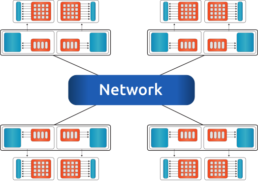
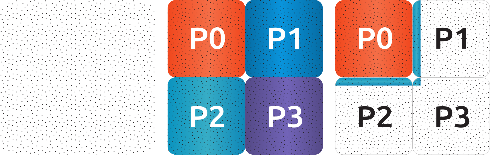

**********************
Multi-node Computation
**********************

Introduction
============
This chapter describes all base objects (matrices and vectors) for computation on multi-node (distributed memory) systems.

.. _multi-node1:
.. figure:: ../data/images/multi-node1.png
  :alt: multi-node system configuration
  :align: center

  An example for a multi-node configuration, where all nodes are connected via network. Single socket systems with a single accelerator.

  An example for a multi-node configuration, where all nodes are connected via network. Dual socket systems with two accelerators attached to each node.

To each compute node, one or more accelerators can be attached. The compute node could be any kind of shared-memory (single, dual, quad CPU) system, details on a single-node can be found in :numref:`single-node`.

.. note:: The memory of accelerator and host are physically different. All nodes can communicate with each other via network.

For the communication channel between different nodes (and between the accelerators on single or multiple nodes) the MPI library is used.

rocALUTION supports non-overlapping type of distribution, where the computational domain is split into several sub-domain with the corresponding information about the boundary and ghost layers. An example is shown in :numref:`domain1`. The square box domain is distributed into four sub-domains. Each subdomain belongs to a process *P0*, *P1*, *P2* and *P3*.

.. _domain1:

  An example for domain distribution.

To perform a sparse matrix-vector multiplication (SpMV), each process need to multiply its own portion of the domain and update the corresponding ghost elements. For *P0*, this multiplication reads

.. math::

  Ax = y, \\
  A_I x_I + A_G x_G = y_I,

where :math:`I` stands for interior and :math:`G` stands for ghost. :math:`x_G` is a vector with three sections, coming from *P1*, *P2* and *P3*. The whole ghost part of the global vector is used mainly for the SpMV product. It does not play any role in the computation of vector-vector operations.

Code Structure
==============
Each object contains two local sub-objects. The global matrix stores interior and ghost matrix by local objects. Similarily, the global vector stores its data by two local objects. In addition to the local data, the global objects have information about the global communication through the parallel manager.

.. _global_objects:
.. figure:: ../data/images/global_objects.png
  :alt: global matrices and vectors
  :align: center

  Global matrices and vectors.

Parallel Manager
================
.. doxygenclass:: rocalution::ParallelManager

The parallel manager class hosts the following functions:

.. doxygenfunction:: rocalution::ParallelManager::SetMPICommunicator
.. doxygenfunction:: rocalution::ParallelManager::Clear
.. doxygenfunction:: rocalution::ParallelManager::GetGlobalSize
.. doxygenfunction:: rocalution::ParallelManager::GetLocalSize
.. doxygenfunction:: rocalution::ParallelManager::GetNumReceivers
.. doxygenfunction:: rocalution::ParallelManager::GetNumSenders
.. doxygenfunction:: rocalution::ParallelManager::GetNumProcs
.. doxygenfunction:: rocalution::ParallelManager::SetGlobalSize
.. doxygenfunction:: rocalution::ParallelManager::SetLocalSize
.. doxygenfunction:: rocalution::ParallelManager::SetBoundaryIndex
.. doxygenfunction:: rocalution::ParallelManager::SetReceivers
.. doxygenfunction:: rocalution::ParallelManager::SetSenders
.. doxygenfunction:: rocalution::ParallelManager::ReadFileASCII
.. doxygenfunction:: rocalution::ParallelManager::WriteFileASCII

To setup a parallel manager, the required information is:

* Global size
* Local size of the interior/ghost for each process
* Communication pattern (what information need to be sent to whom)

Global Matrices and Vectors
===========================
.. doxygenfunction:: rocalution::GlobalMatrix::GetInterior
.. doxygenfunction:: rocalution::GlobalMatrix::GetGhost
.. doxygenfunction:: rocalution::GlobalVector::GetInterior

The global matrices and vectors store their data via two local objects. For the global matrix, the interior can be access via the :cpp:func:`rocalution::GlobalMatrix::GetInterior` and :cpp:func:`rocalution::GlobalMatrix::GetGhost` functions, which point to two valid local matrices. Similarily, the global vector can be accessed by :cpp:func:`rocalution::GlobalVector::GetInterior`.

Asynchronous SpMV
-----------------
To minimize latency and to increase scalability, rocALUTION supports asynchronous sparse matrix-vector multiplication. The implementation of the SpMV starts with asynchronous transfer of the required ghost buffers, while at the same time it computes the interior matrix-vector product. When the computation of the interior SpMV is done, the ghost transfer is synchronized and the ghost SpMV is performed. To minimize the PCI-E bus, the HIP implementation provides a special packaging technique for transferring all ghost data into a contiguous memory buffer.

File I/O
========
The user can store and load all global structures from and to files. For a solver, the necessary data would be

* the parallel manager
* the sparse matrix
* and the vector

Reading/writing from/to files can be done fully in parallel without any communication. :numref:`4x4_mpi` visualizes data of a :math:`4 \times 4` grid example which is distributed among 4 MPI processes (organized in :math:`2 \times 2`). Each local matrix stores the local unknowns (with local indexing). :numref:`4x4_mpi_rank0` furthermore illustrates the data associated with *RANK0*.

.. _4x4_mpi:

  An example of :math:`4 \times 4` grid, distributed in 4 domains (:math:`2 \times 2`).

.. _4x4_mpi_rank0:
.. figure:: ../data/images/4x4_mpi_rank0.png
  :alt: 4x4 grid, distributed in 4 domains (2x2), showing rank0
  :align: center

  An example of 4 MPI processes and the data associated with *RANK0*.

File Organization
-----------------
When the parallel manager, global matrix or global vector are writing to a file, the main file (passed as a file name to this function) will contain information for all files on all ranks.

.. code-block:: RST

  parallelmanager.dat.rank.0
  parallelmanager.dat.rank.1
  parallelmanager.dat.rank.2
  parallelmanager.dat.rank.3

.. code-block:: RST

  matrix.mtx.interior.rank.0
  matrix.mtx.ghost.rank.0
  matrix.mtx.interior.rank.1
  matrix.mtx.ghost.rank.1
  matrix.mtx.interior.rank.2
  matrix.mtx.ghost.rank.2
  matrix.mtx.interior.rank.3
  matrix.mtx.ghost.rank.3

.. code-block:: RST

  rhs.dat.rank.0
  rhs.dat.rank.1
  rhs.dat.rank.2
  rhs.dat.rank.3

Parallel Manager
----------------
The data for each rank can be split into receiving and sending information. For receiving data from neighboring processes, see :numref:`receiving`, *RANK0* need to know what type of data will be received and from whom. For sending data to neighboring processes, see :numref:`sending`, *RANK0* need to know where and what to send.

.. _receiving:

  An example of 4 MPI processes, *RANK0* receives data (the associated data is marked bold).

To receive data, *RANK0* requires:

* Number of MPI ranks, which will send data to *RANK0* (NUMBER_OF_RECEIVERS - integer value).
* Which are the MPI ranks, sending the data (RECEIVERS_RANK - integer array).
* How will the received data (from each rank) be stored in the ghost vector (RECEIVERS_INDEX_OFFSET - integer array). In this example, the first 30 elements will be received from *P1* :math:`[0, 2)` and the second 30 from *P2* :math:`[2, 4)`.

.. _sending:
.. figure:: ../data/images/sending.png
  :alt: sending data example
  :align: center

  An example of 4 MPI processes, *RANK0* sends data (the associated data is marked bold).

To send data, *RANK0* requires:

* Total size of the sending information (BOUNDARY_SIZE - integer value).
* Number of MPI ranks, which will receive data from *RANK0* (NUMBER_OF_SENDERS - integer value).
* Which are the MPI ranks, receiving the data (SENDERS_RANK - integer array).
* How will the sending data (from each rank) be stored in the sending buffer (SENDERS_INDEX_OFFSET - integer array). In this example, the first 30 elements will be sent to *P1* :math:`[0, 2)` and the second 30 to *P2* :math:`[2, 4)`.
* The elements, which need to be send (BOUNDARY_INDEX - integer array). In this example, the data which need to be send to *P1* and *P2* is the ghost layer, marked as ghost *P0*. The vertical stripe need to be send to *P1* and the horizontal stripe to *P2*. The numbering of local unknowns (in local indexing) for *P1* (the vertical stripes) are 1, 2 (size of 2) and stored in the BOUNDARY_INDEX. After 2 elements, the elements for *P2* are stored, they are 2, 3 (2 elements).

Matrices
--------
Each rank hosts two local matrices, interior and ghost matrix. They can be stored in separate files, one for each matrix. The file format could be Matrix Market (MTX) or binary.

Vectors
-------
Each rank holds the local interior vector only. It is stored in a single file. The file could be ASCII or binary.
