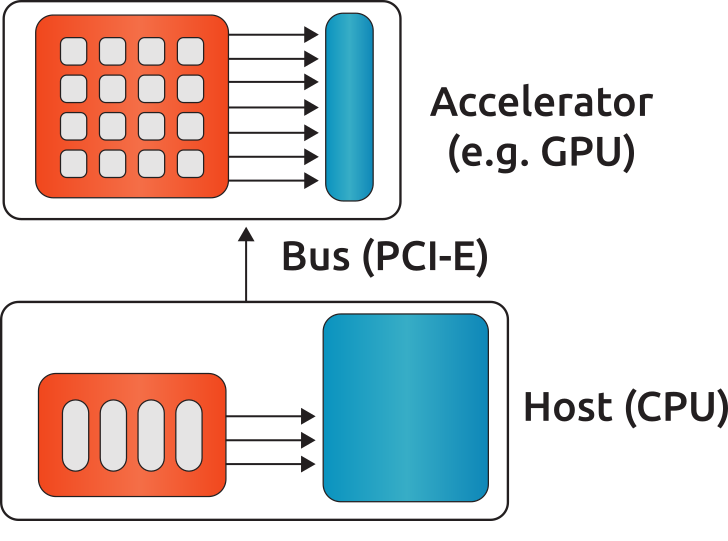

***********************
Single-node Computation
***********************

Introduction
============
In this chapter, all base objects (matrices, vectors and stencils) for computation on a single-node (shared-memory) system are described. A typical configuration is illustrated in :numref:`single-node`.

.. _single-node:

  A typical single-node configuration, where gray boxes represent the cores, blue boxes represent the memory and arrows represent the bandwidth.

The compute node contains none, one or more accelerators. The compute node could be any kind of shared-memory (single, dual, quad CPU) system.

.. note:: The host and accelerator memory can be physically different.

ValueType
=========
The value (data) type of the vectors and the matrices is defined as a template. The matrix can be of type float (32-bit), double (64-bit) and complex (64/128-bit). The vector can be float (32-bit), double (64-bit), complex (64/128-bit) and int (32/64-bit). The information about the precision of the data type is shown in the :cpp:func:`rocalution::BaseRocalution::Info` function.

Complex Support
===============
Currently, rocALUTION does not support complex computation.

Allocation and Free
===================
.. doxygenfunction:: rocalution::LocalVector::Allocate
.. doxygenfunction:: rocalution::LocalVector::Clear
.. doxygenfunction:: rocalution::LocalMatrix::AllocateCOO
  :outline:
.. doxygenfunction:: rocalution::LocalMatrix::AllocateCSR
  :outline:
.. doxygenfunction:: rocalution::LocalMatrix::AllocateBCSR
  :outline:
.. doxygenfunction:: rocalution::LocalMatrix::AllocateMCSR
  :outline:
.. doxygenfunction:: rocalution::LocalMatrix::AllocateELL
  :outline:
.. doxygenfunction:: rocalution::LocalMatrix::AllocateDIA
  :outline:
.. doxygenfunction:: rocalution::LocalMatrix::AllocateHYB
  :outline:
.. doxygenfunction:: rocalution::LocalMatrix::AllocateDENSE

.. note:: More detailed information on the additional parameters required for matrix allocation is given in :ref:`matrix_formats`.
.. doxygenfunction:: rocalution::LocalMatrix::Clear

.. _matrix_formats:

Matrix Formats
==============
Matrices, where most of the elements are equal to zero, are called sparse. In most practical applications, the number of non-zero entries is proportional to the size of the matrix (e.g. typically, if the matrix :math:`A \in \mathbb{R}^{N \times N}`, then the number of elements are of order :math:`O(N)`). To save memory, storing zero entries can be avoided by introducing a structure corresponding to the non-zero elements of the matrix. rocALUTION supports sparse CSR, MCSR, COO, ELL, DIA, HYB and dense matrices (DENSE).

.. note:: The functionality of every matrix object is different and depends on the matrix format. The CSR format provides the highest support for various functions. For a few operations, an internal conversion is performed, however, for many routines an error message is printed and the program is terminated.
.. note:: In the current version, some of the conversions are performed on the host (disregarding the actual object allocation - host or accelerator).

.. code-block:: cpp

  // Convert mat to CSR storage format
  mat.ConvertToCSR();
  // Perform a matrix-vector multiplication y = mat * x in CSR format
  mat.Apply(x, &y);

  // Convert mat to ELL storage format
  mat.ConvertToELL();
  // Perform a matrix-vector multiplication y = mat * x in ELL format
  mat.Apply(x, &y);

.. code-block:: cpp

  // Convert mat to CSR storage format
  mat.ConvertTo(CSR);
  // Perform a matrix-vector multiplication y = mat * x in CSR format
  mat.Apply(x, &y);

  // Convert mat to ELL storage format
  mat.ConvertTo(ELL);
  // Perform a matrix-vector multiplication y = mat * x in ELL format
  mat.Apply(x, &y);

COO storage format
------------------
The most intuitive sparse format is the coordinate format (COO). It represents the non-zero elements of the matrix by their coordinates and requires two index arrays (one for row and one for column indexing) and the values array. A :math:`m \times n` matrix is represented by

=========== ==================================================================
m           number of rows (integer).
n           number of columns (integer).
nnz         number of non-zero elements (integer).
coo_val     array of ``nnz`` elements containing the data (floating point).
coo_row_ind array of ``nnz`` elements containing the row indices (integer).
coo_col_ind array of ``nnz`` elements containing the column indices (integer).
=========== ==================================================================

.. note:: The COO matrix is expected to be sorted by row indices and column indices per row. Furthermore, each pair of indices should appear only once.

Consider the following :math:`3 \times 5` matrix and the corresponding COO structures, with :math:`m = 3, n = 5` and :math:`\text{nnz} = 8`:

.. math::

  A = \begin{pmatrix}
        1.0 & 2.0 & 0.0 & 3.0 & 0.0 \\
        0.0 & 4.0 & 5.0 & 0.0 & 0.0 \\
        6.0 & 0.0 & 0.0 & 7.0 & 8.0 \\
      \end{pmatrix}

where

.. math::

  \begin{array}{ll}
    \text{coo_val}[8] & = \{1.0, 2.0, 3.0, 4.0, 5.0, 6.0, 7.0, 8.0\} \\
    \text{coo_row_ind}[8] & = \{0, 0, 0, 1, 1, 2, 2, 2\} \\
    \text{coo_col_ind}[8] & = \{0, 1, 3, 1, 2, 0, 3, 4\}
  \end{array}

CSR storage format
------------------
One of the most popular formats in many scientific codes is the compressed sparse row (CSR) format. In this format, instead of row indices, the row offsets to the beginning of each row are stored. Thus, each row elements can be accessed sequentially. However, this format does not allow sequential accessing of the column entries.
The CSR storage format represents a :math:`m \times n` matrix by

=========== =========================================================================
m           number of rows (integer).
n           number of columns (integer).
nnz         number of non-zero elements (integer).
csr_val     array of ``nnz`` elements containing the data (floating point).
csr_row_ptr array of ``m+1`` elements that point to the start of every row (integer).
csr_col_ind array of ``nnz`` elements containing the column indices (integer).
=========== =========================================================================

.. note:: The CSR matrix is expected to be sorted by column indices within each row. Furthermore, each pair of indices should appear only once.

Consider the following :math:`3 \times 5` matrix and the corresponding CSR structures, with :math:`m = 3, n = 5` and :math:`\text{nnz} = 8`:

.. math::

  A = \begin{pmatrix}
        1.0 & 2.0 & 0.0 & 3.0 & 0.0 \\
        0.0 & 4.0 & 5.0 & 0.0 & 0.0 \\
        6.0 & 0.0 & 0.0 & 7.0 & 8.0 \\
      \end{pmatrix}

where

.. math::

  \begin{array}{ll}
    \text{csr_val}[8] & = \{1.0, 2.0, 3.0, 4.0, 5.0, 6.0, 7.0, 8.0\} \\
    \text{csr_row_ptr}[4] & = \{0, 3, 5, 8\} \\
    \text{csr_col_ind}[8] & = \{0, 1, 3, 1, 2, 0, 3, 4\}
  \end{array}

ELL storage format
------------------
The Ellpack-Itpack (ELL) storage format can be seen as a modification of the CSR format without row offset pointers. Instead, a fixed number of elements per row is stored.
It represents a :math:`m \times n` matrix by

=========== ================================================================================
m           number of rows (integer).
n           number of columns (integer).
ell_width   maximum number of non-zero elements per row (integer)
ell_val     array of ``m times ell_width`` elements containing the data (floating point).
ell_col_ind array of ``m times ell_width`` elements containing the column indices (integer).
=========== ================================================================================

.. note:: The ELL matrix is assumed to be stored in column-major format. Rows with less than ``ell_width`` non-zero elements are padded with zeros (``ell_val``) and :math:`-1` (``ell_col_ind``).

Consider the following :math:`3 \times 5` matrix and the corresponding ELL structures, with :math:`m = 3, n = 5` and :math:`\text{ell_width} = 3`:

.. math::

  A = \begin{pmatrix}
        1.0 & 2.0 & 0.0 & 3.0 & 0.0 \\
        0.0 & 4.0 & 5.0 & 0.0 & 0.0 \\
        6.0 & 0.0 & 0.0 & 7.0 & 8.0 \\
      \end{pmatrix}

where

.. math::

  \begin{array}{ll}
    \text{ell_val}[9] & = \{1.0, 4.0, 6.0, 2.0, 5.0, 7.0, 3.0, 0.0, 8.0\} \\
    \text{ell_col_ind}[9] & = \{0, 1, 0, 1, 2, 3, 3, -1, 4\}
  \end{array}

.. _DIA storage format:

DIA storage format
------------------
If all (or most) of the non-zero entries belong to a few diagonals of the matrix, they can be stored with the corresponding offsets. The values in DIA format are stored as array with size :math:`D \times N_D`, where :math:`D` is the number of diagonals in the matrix and :math:`N_D` is the number of elements in the main diagonal. Since not all values in this array are occupied, the not accessible entries are denoted with :math:`\ast`. They correspond to the offsets in the diagonal array (negative values represent offsets from the beginning of the array).
The DIA storage format represents a :math:`m \times n` matrix by

========== ====
m          number of rows (integer)
n          number of columns (integer)
ndiag      number of occupied diagonals (integer)
dia_offset array of ``ndiag`` elements containing the offset with respect to the main diagonal (integer).
dia_val	   array of ``m times ndiag`` elements containing the values (floating point).
========== ====

Consider the following :math:`5 \times 5` matrix and the corresponding DIA structures, with :math:`m = 5, n = 5` and :math:`\text{ndiag} = 4`:

.. math::

  A = \begin{pmatrix}
        1 & 2 & 0 & 11 & 0 \\
        0 & 3 & 4 & 0 & 0 \\
        0 & 5 & 6 & 7 & 0 \\
        0 & 0 & 0 & 8 & 0 \\
        0 & 0 & 0 & 9 & 10
      \end{pmatrix}

where

.. math::

  \begin{array}{ll}
    \text{dia_val}[20] & = \{\ast, 0, 5, 0, 9, 1, 3, 6, 8, 10, 2, 4, 7, 0, \ast, 11, 0, \ast, \ast, \ast\} \\
    \text{dia_offset}[4] & = \{-1, 0, 1, 3\}
  \end{array}

.. _HYB storage format:

HYB storage format
------------------
The DIA and ELL formats cannot represent efficiently completely unstructured sparse matrices. To keep the memory footprint low, DIA requires the elements to belong to a few diagonals and ELL needs a fixed number of elements per row. For many applications this is a too strong restriction. A solution to this issue is to represent the more regular part of the matrix in such a format and the remaining part in COO format. The HYB format is a mixture between ELL and COO, where the maximum elements per row for the ELL part is computed by `nnz/m`. It represents a :math:`m \times n` matrix by

=========== =========================================================================================
m           number of rows (integer).
n           number of columns (integer).
nnz         number of non-zero elements of the COO part (integer)
ell_width   maximum number of non-zero elements per row of the ELL part (integer)
ell_val     array of ``m times ell_width`` elements containing the ELL part data (floating point).
ell_col_ind array of ``m times ell_width`` elements containing the ELL part column indices (integer).
coo_val     array of ``nnz`` elements containing the COO part data (floating point).
coo_row_ind array of ``nnz`` elements containing the COO part row indices (integer).
coo_col_ind array of ``nnz`` elements containing the COO part column indices (integer).
=========== =========================================================================================

For further details on matrix formats, see :cite:`SAAD`.

Memory Usage
------------
The memory footprint of the different matrix formats is presented in the following table, considering a :math:`N \times N` matrix, where the number of non-zero entries is denoted with `nnz`.

====== =========================== =======
Format Structure                   Values
====== =========================== =======
DENSE                              :math:`N \times N`
COO    :math:`2 \times \text{nnz}` :math:`\text{nnz}`
CSR    :math:`N + 1 + \text{nnz}`  :math:`\text{nnz}`
ELL    :math:`M \times N`          :math:`M \times N`
DIA    :math:`D`                   :math:`D \times N_D`
====== =========================== =======

For the ELL matrix :math:`M` characterizes the maximal number of non-zero elements per row and for the DIA matrix, :math:`D` defines the number of diagonals and :math:`N_D` defines the size of the main diagonal.

File I/O
========
.. doxygenfunction:: rocalution::LocalVector::ReadFileASCII
.. doxygenfunction:: rocalution::LocalVector::WriteFileASCII
.. doxygenfunction:: rocalution::LocalVector::ReadFileBinary
.. doxygenfunction:: rocalution::LocalVector::WriteFileBinary
.. doxygenfunction:: rocalution::LocalMatrix::ReadFileMTX
.. doxygenfunction:: rocalution::LocalMatrix::WriteFileMTX
.. doxygenfunction:: rocalution::LocalMatrix::ReadFileCSR
.. doxygenfunction:: rocalution::LocalMatrix::WriteFileCSR

For further details on the Matrix Market Format, see :cite:`mm`.

Access
======

.. doxygenfunction:: rocalution::LocalVector::operator
  :outline:
.. doxygenfunction:: rocalution::LocalVector::operator const

.. note:: Accessing elements via the *[]* operators is slow. Use this for debugging purposes only. There is no direct access to the elements of matrices due to the sparsity structure. Matrices can be imported by a copy function. For CSR matrices, this is :cpp:func:`rocalution::LocalMatrix::CopyFromCSR` and :cpp:func:`rocalution::LocalMatrix::CopyToCSR`.

.. code-block:: cpp

  // Allocate the CSR matrix
  int* csr_row_ptr   = new int[100 + 1];
  int* csr_col_ind   = new int[345];
  ValueType* csr_val = new ValueType[345];

  // Fill the CSR matrix
  // ...

  // rocALUTION local matrix object
  LocalMatrix<ValueType> mat;

  // Import CSR matrix to rocALUTION
  mat.AllocateCSR("my_matrix", 345, 100, 100);
  mat.CopyFromCSR(csr_row_ptr, csr_col, csr_val);

Raw Access to the Data
======================

.. _SetDataPtr:

SetDataPtr
----------
For vector and matrix objects, direct access to the raw data can be obtained via pointers. Already allocated data can be set with *SetDataPtr*. Setting data pointers will leave the original pointers empty.

.. doxygenfunction:: rocalution::LocalVector::SetDataPtr
.. doxygenfunction:: rocalution::LocalMatrix::SetDataPtrCOO
  :outline:
.. doxygenfunction:: rocalution::LocalMatrix::SetDataPtrCSR
  :outline:
.. doxygenfunction:: rocalution::LocalMatrix::SetDataPtrMCSR
  :outline:
.. doxygenfunction:: rocalution::LocalMatrix::SetDataPtrELL
  :outline:
.. doxygenfunction:: rocalution::LocalMatrix::SetDataPtrDIA
  :outline:
.. doxygenfunction:: rocalution::LocalMatrix::SetDataPtrDENSE

.. _LeaveDataPtr:

LeaveDataPtr
------------
With *LeaveDataPtr*, the raw data from the object can be obtained. This will leave the object empty.

.. doxygenfunction:: rocalution::LocalVector::LeaveDataPtr
.. doxygenfunction:: rocalution::LocalMatrix::LeaveDataPtrCOO
  :outline:
.. doxygenfunction:: rocalution::LocalMatrix::LeaveDataPtrCSR
  :outline:
.. doxygenfunction:: rocalution::LocalMatrix::LeaveDataPtrMCSR
  :outline:
.. doxygenfunction:: rocalution::LocalMatrix::LeaveDataPtrELL
  :outline:
.. doxygenfunction:: rocalution::LocalMatrix::LeaveDataPtrDIA
  :outline:
.. doxygenfunction:: rocalution::LocalMatrix::LeaveDataPtrDENSE

.. note:: If the object is allocated on the host, then the pointers obtained from :ref:`SetDataPtr` and :ref:`LeaveDataPtr` will be on the host. If the vector object is on the accelerator, then the data pointers will be on the accelerator.
.. note:: If the object is moved to and from the accelerator, then the original pointer will be invalid.
.. note:: Never rely on old pointers, hidden object movement to and from the accelerator will make them invalid.
.. note:: Whenever you pass or obtain pointers to/from a rocALUTION object, you need to use the same memory allocation/free functions. Please check the source code for that (for host *src/utils/allocate_free.cpp* and for HIP *src/base/hip/hip_allocate_free.cpp*)

Copy CSR Matrix Host Data
=========================
.. doxygenfunction:: rocalution::LocalMatrix::CopyFromHostCSR

Copy Data
=========
The user can copy data to and from a local vector by using *CopyFromData()* *CopyToData()*.

.. doxygenfunction:: rocalution::LocalVector::CopyFromData
.. doxygenfunction:: rocalution::LocalVector::CopyToData

Object Info
===========
.. doxygenfunction:: rocalution::BaseRocalution::Info

Copy
====
All matrix and vector objects provide a *CopyFrom()* function. The destination object should have the same size or be empty. In the latter case, the object is allocated at the source platform.

.. doxygenfunction:: rocalution::LocalVector::CopyFrom(const LocalVector<ValueType>&)
.. doxygenfunction:: rocalution::LocalMatrix::CopyFrom

.. note:: For vectors, the user can specify source and destination offsets and thus copy only a part of the whole vector into another vector.

.. doxygenfunction:: rocalution::LocalVector::CopyFrom(const LocalVector<ValueType>&, int, int, int)

Clone
=====
The copy operators allow you to copy the values of the object to another object, without changing the backend specification of the object. In many algorithms, you might need auxiliary vectors or matrices. These objects can be cloned with CloneFrom().

CloneFrom
---------
.. doxygenfunction:: rocalution::LocalVector::CloneFrom
.. doxygenfunction:: rocalution::LocalMatrix::CloneFrom

CloneBackend
------------
.. doxygenfunction:: rocalution::BaseRocalution::CloneBackend(const BaseRocalution<ValueType>&)

Check
=====
.. doxygenfunction:: rocalution::LocalVector::Check
.. doxygenfunction:: rocalution::LocalMatrix::Check

Checks, if the object contains valid data. For vectors, the function checks if the values are not infinity and not NaN (not a number). For matrices, this function checks the values and if the structure of the matrix is correct (e.g. indices cannot be negative, CSR and COO matrices have to be sorted, etc.).

Sort
====
.. doxygenfunction:: rocalution::LocalMatrix::Sort

Keying
======
.. doxygenfunction:: rocalution::LocalMatrix::Key

Graph Analyzers
===============
The following functions are available for analyzing the connectivity in graph of the underlying sparse matrix.

* (R)CMK Ordering
* Maximal Independent Set
* Multi-Coloring
* Zero Block Permutation
* Connectivity Ordering

All graph analyzing functions return a permutation vector (integer type), which is supposed to be used with the :cpp:func:`rocalution::LocalMatrix::Permute` and :cpp:func:`rocalution::LocalMatrix::PermuteBackward` functions in the matrix and vector classes.

For further details, see :cite:`SAAD`.

Cuthill-McKee Ordering
----------------------
.. doxygenfunction:: rocalution::LocalMatrix::CMK
.. doxygenfunction:: rocalution::LocalMatrix::RCMK

Maximal Independent Set
-----------------------
.. doxygenfunction:: rocalution::LocalMatrix::MaximalIndependentSet

Multi-Coloring
--------------
.. doxygenfunction:: rocalution::LocalMatrix::MultiColoring

Zero Block Permutation
----------------------
.. doxygenfunction:: rocalution::LocalMatrix::ZeroBlockPermutation

Connectivity Ordering
---------------------
.. doxygenfunction:: rocalution::LocalMatrix::ConnectivityOrder

Basic Linear Algebra Operations
===============================
For a full list of functions and routines involving operators and vectors, see the API specifications.
